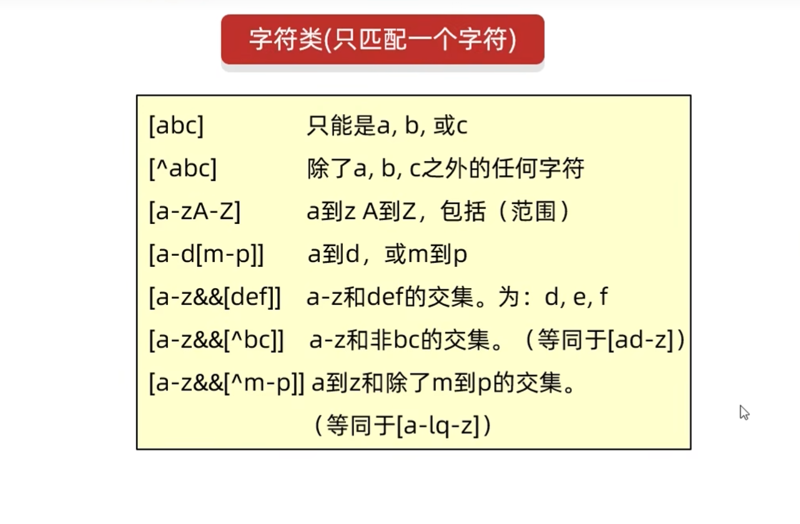
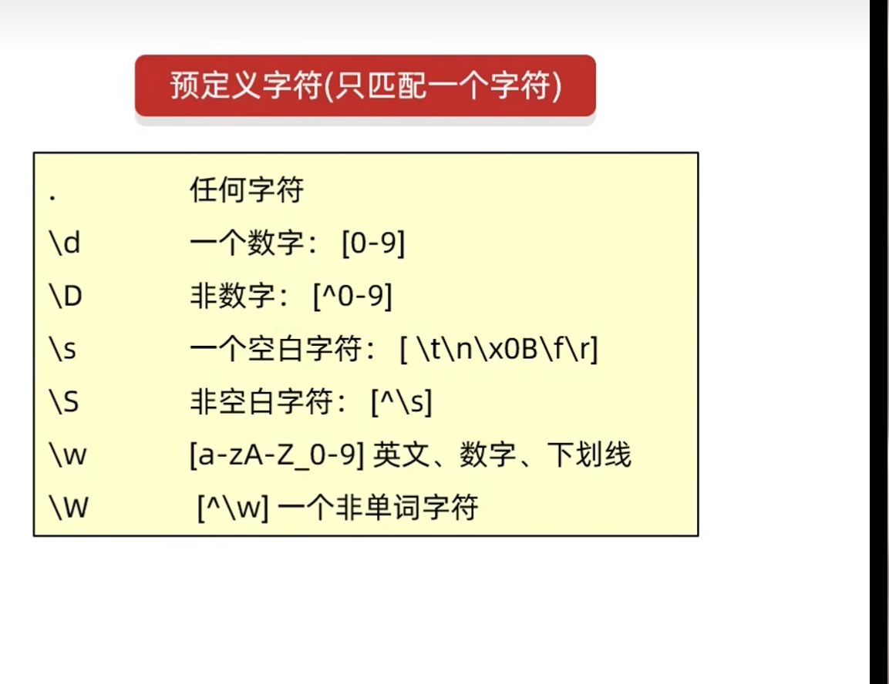

[toc]


# Java学习

## P157-常用API学习-System

System是一个工具类，提供一些与系统相关的方法
|方法名|说明|
|:-:|:-:|
|pulic static void exit(int status)|终止当前Java虚拟机|
|public static long currentTimeMills|返回当前系统的毫秒值形式|
|public static void arraycopy(数据源数组,起始索引,目的地数组,起始索引,拷贝个数)|数组拷贝|

计算机时间原点:**1970年1月1日00:00:00**,我国在东八区,有八个小时时差,所以应该是**1970年1月1日00:08:00**

> public static void exit(int status),参数status，0为正常退出,非0是不正常推出

> public static long currentTimeMills()这个方法可以用它来计算函数的执行时间,下面是一个例子

```java
long start = System.currentTimeMillis();
        for (int i = 1; i < 1000; i++) {
            boolean result = isPrime1(i);
            if (result) {
                System.out.println(i);
            }
        }
        long end = System.currentTimeMillis();
        System.out.println("程序执行时间" + (end - start));

        long start1 = System.currentTimeMillis();
        for (int i = 1; i < 100; i++) {
            boolean result = isPrime2(i);
            if (result) {
                System.out.println(i);
            }
        }
        long end1 = System.currentTimeMillis();
        System.out.println("程序执行时间" + (end1 - start1));

    }

    public static boolean isPrime1(int num) {
        for (int i = 2; i < num; i++) {
            if (num % i == 0) {
                return false;
            }
        }
        return true;
    }

    public static boolean isPrime2(int num) {
        for (int i = 2; i < Math.sqrt(num); i++) {
            if (num % i == 0) {
                return false;
            }
        }
        return true;
    }
```

这段代码是用来检测这两个判断是否为质数的执行速度的

> public static void arraycopy(数据源数组,起始索引,目的地数组,起始索引,拷贝个数)

```java
        // 如何使用System.arraycopy
        //基本数据类型
        int[] arr1 = { 1, 2, 3, 4, 5, 6, 7, 8, 9, 10 };
        int[] arr2 = new int[10];
        //参数一:要拷贝的源数组
        //参数二:拷贝的索引
        //参数三:目标数组
        //参数四:目标数组索引
        //参数五:需要复制的个数
        System.arraycopy(arr1, 0, arr2, 0, 10);

        for (int arr22 : arr2) {
            System.out.println(arr22);
        }
        
        //引用数据类型
        Student s1 = new Student("wx", 12);
        Student s2 = new Student("ww", 22);
        Student s3 = new Student("wa", 99);

        Student[] stuArr = { s1, s2, s3 };
        Person[] perArr = new Person[3];
        System.arraycopy(stuArr, 0, perArr, 0, 3);
        for (Person person : perArr) {
            System.out.println(person.getAge() + "," + person.getName());
```

> 如果数据源数组和目的地数组都是基本数据类型,那么就需要保持两者的类型相同,否则就会报错例如:int[]不能拷贝到double[]中
>如果数据源数组和目的地数组都是引用数据类型,那么子类对象可以赋值给父类类型,

## P158-常用API学习-Runtime

<font size=5>Runtime</font>
//这是一个修改，这是第二个
>Runtime表示当前虚拟机的运行环境

这个类对象不能自己new,需要使用方法获取

|方法名|说明|
|:-:|:-:|
|public static Runtime getRuntime()|获取系统的运行环境对象|
|public void exit(int status)|停止虚拟机,跟上面的System.exit(int staus)相同|
|public int availableProcessors()|获取CPU线程数|
|public long maxMemory()|JVM虚拟机从系统中获取的总内存大小(单位byte)|
|pulic long totalMemory()|JVM虚拟机已经获取的内存大小(单位byte)|
|public long freeMemory()|JVM剩余内存大小(单位byte)|
|public Process exec(String command)|运行cmd命令|

>温馨提示:如果想要将byte转换为KB或者MB，需要byte / 1024 = KB ,因为1kb=1024byte

```java
恶搞别人个关机程序
package JavaP158;

import java.awt.event.ActionEvent;
import java.awt.event.ActionListener;
import java.io.IOException;

import javax.swing.JButton;
import javax.swing.JDialog;
import javax.swing.JFrame;
import javax.swing.JLabel;
import javax.swing.WindowConstants;

public class JavaP58DemoJFame extends JFrame implements ActionListener {
    // 将按钮对象定义到成员位置,以便为了调用
    JButton yesBut = new JButton("帅炸了");
    JButton midBut = new JButton("我错了");
    JButton badBut = new JButton("好丑");
    // 获取系统runtime对象

    public JavaP58DemoJFame() {
        intitJFame();
        initView();
        // 设置显示
        setVisible(true);
    }

    public void intitJFame() {
        // 设置宽高
        setSize(500, 600);
        // 设置标题
        setTitle("恶搞基友");
        // 设置关闭模式
        setDefaultCloseOperation(WindowConstants.DO_NOTHING_ON_CLOSE);
        // 设置一直在最上面
        setAlwaysOnTop(true);
        // 设置居中
        setLocationRelativeTo(null);
        // 取消默认位置
        setLayout(null);
    }

    public void initView() {
        getContentPane().removeAll();
        JLabel test = new JLabel("你觉得我帅吗");

        // System.out.println(test.getText());
        test.setBounds(200, 150, 300, 50);
        // 设置按钮尺寸和位置
        yesBut.setBounds(100, 250, 300, 50);
        midBut.setBounds(200, 325, 100, 30);
        badBut.setBounds(160, 400, 180, 30);
        // 绑定事件监听
        yesBut.addActionListener(this);
        midBut.addActionListener(this);
        badBut.addActionListener(this);
        // 将按钮添加到界面中
        getContentPane().add(yesBut);
        getContentPane().add(midBut);
        getContentPane().add(badBut);
        // 添加提示语
        getContentPane().add(test);
        getContentPane().repaint();
    }

    @Override
    public void actionPerformed(ActionEvent e) {
        // 获取是哪个对象
        Object object = e.getSource();
        if (object == yesBut) {
            showDiwlog("谢谢夸奖");
        } else if (object == midBut) {
            showDiwlog("我错了");
            try {
                // 执行系统cmd程序
                Runtime.getRuntime().exec(new String[] { "shutdown", "-a" });
            } catch (IOException e1) {
                // TODO Auto-generated catch block
                e1.printStackTrace();
            }
        } else if (object == badBut) {
            showDiwlog("你完了");
            try {
                // 执行系统cmd程序
                Runtime.getRuntime().exec(new String[] { "shutdown", "-s", "-t", "100" });
            } catch (IOException e1) {
                // TODO Auto-generated catch block
                e1.printStackTrace();
            }
        }
    }

    public void showDiwlog(String context) {// 跳出弹框
        JDialog jdialog = new javax.swing.JDialog();
        // 设置弹窗尺寸
        jdialog.setSize(200, 150);
        // 始终再最上面
        jdialog.setAlwaysOnTop(true);
        // 设置一直居中
        jdialog.setLocationRelativeTo(null);
        // 弹窗不关闭就无法操作下面的界面
        jdialog.setModal(true);
        // 设置描述,添加到弹窗里面
        JLabel warn = new JLabel(context);
        // 设置描述大小
        warn.setBounds(0, 0, 200, 150);
        // 将弹窗添加到弹窗容器内
        jdialog.getContentPane().add(warn);
        // 让弹窗显示
        jdialog.setVisible(true);
    }
    执行方法:
    package JavaP158;

    public class JavaP158Demo {
        public static void main(String[] args) {
            new JavaP58DemoJFame();
        }

    }

}

```

## P159-常用API-Object

- Object类是所有类的顶级父类,所有类间接或直接继承于Object类
- Object类可以被所有子类访问,所以要学习Object类中的方法

Object构造方法
|方法名|空参构造|
|:-:|:-:|
|public Object()|空参构造|
|public String toString()|返回对象的字符串表示形式|
|public Object clone(int a)|对象克隆|

- **toString方法**

```java
// 1.toString,将对象以字符串格式返回
        Object object = new Object();
        String str = object.toString();
        System.out.println(str);// java.lang.Object@5f5a92bb
        // 有一个细节:这里并没有写toString,但是直接输出还是跟上面的相同
        // System:类名
        // out:静态常量名,这里的final修饰的是引用数据类型,地址值不能变,内容可以变
        // println():方法名
        // 参数:标识要输出的内容
        // 核心逻辑,当我们打印一个对象的时候,底层会调用对象的toString方法,把对象变成字符串,然后再打印再控制台上,打印完毕换行处理
    
        System.out.println(object);
       //下面是图例
```

 


- **equals方法**

>默认比较的是地址值,图例如下


如果不想要比较地址值的话,可以重写equals方法

```java
       //这是对equals的小练习
        String s1 = "abc";
        StringBuilder s2 = new StringBuilder("abc");
        
        System.out.println(s1.equals(s2));
        // 因为equals是被s1调用的，而s1是字符串,调用的是字符串里面的equals方法
        // 字符串里面的equals方法,先判断参数是否是字符串
        // 但是s2是StringBuilder的类对象,所以就不相等
        // 所以就会返回false
        System.out.println(s2.equals(s1));
        // 这里equals是被s2调用的,而s2是StringBuilder类对象
        // 在StringBuilder中,没有重写equals方法
        // 所以调用的是object中的equals方法
        // 在object中,==号比较的是地址值
        // 所以这两个记录地址值不一样,就会返回false
    }
```

## P160-常用API-浅克隆，深克隆，对象工具类Objects

把A对象的属性完全拷贝给B对象,也叫对象拷贝,对象复制

> protected权限修饰符解释
   总之，当B extends A的时候，在子类B的作用范围内，只能调用本子类B定义的对象的protected方法(该方法从父类A中继承而来)。而不能调用其他A类（A 本身和从A继承）对象的protected方法

克隆方式

- 浅克隆:不管对象内部属性是基本数据类型还是引用数据类型,都会完全拷贝过来
- 深克隆:基本数据类型拷贝过来,字符串复用,引用数据类型会重新创建新的

现在使用深克隆可以使用一个第三方工具Gson，只要导入就可以了

[Gson下载链接](https://search.maven.org/remotecontent?filepath=com/google/code/gson/gson/2.10.1/gson-2.10.1.jar)

使用方式

```java
// 对象的浅克隆，深克隆和对象工具类Objects
        int[] data = { 1, 2, 3, 4, 5, 67 };
        // 1.先创建一个对象
        User u1 = new User(12, "wx", "123456", "美国大区", data);
        System.out.println(u1);
        // 2.进行对象的克隆
        // 书写细节:重写Object中的clone方法
        // 让JavaBean类实现Cloneable接口
        // 创建原对象并调用clone就可以了

        User u2 = (User) u1.clone();
        System.out.println(u2);
        // Object中的clone是浅克隆
        
        int[] add = u1.getData();
        add[0] = 100;
        System.out.println(u1);
        System.out.println(u2);

        //如果需要进行深克隆,需要重写Object类中的clone方法
        //或者使用gson外部库
------------------------------------------


        /
        // Gson是一个外部库,需要导入
        // 创建一个对象
        Gson gson = new Gson();
        // 将对象变成Json字符串
        String s = gson.toJson(u1);
        // 打印Json字符串
        System.out.println(s);
        // 将字符串变回对象,有两个参数，前面是Json字符串，后面是对象的类型
        User user = gson.fromJson(s, User.class);
        // 打印user对象
        System.out.println(user);
        // 可以代替深克隆使用
        User user2 = gson.fromJson(s, User.class);
        System.out.println(user2);
```

Objects是一个工具类,提供了一些方法去完成一些功能

|序号|方法名|说明|
|:-:|:-:|:-:|
|1|public static boolean equals(Object a,Object b)|先做非空判断,然后比较两个对象|
|2|public staic boolean isNull(Object a)|判断对象是否为Null，是则返回true|
|3|public staic boolean nonNull(Object a)|判断对象是否为Null，是则返回true|

- 1:细节

```java
// Objects工具类学习
        Student s1 = new Student("zhangsan", 12);
        Student soneHalf = null;
        Student s2 = new Student("zhangsan", 12);
        // System.out.println(s1.equals(s2));
        System.out.println(Objects.equals(s1, s2));
        System.out.println(Objects.equals(soneHalf, s2));
        // Objects.equals方法细节
        // 方法底层会判断s1是否为null,如果为Null，直接返回false
        // 如果s1不为null,那么就利用s1再次调用equals方法
        // 如果s1是Student类型,所以最终还是会调用Student中的equals方法
        // 如果没有重写,比较地址值，如果重写了,比较属性值

```


## P161 常用API-BigInteger

在Java中,整数有四种类型

|类型|占用字节大小|
|:-:|:-:|
|byte|1|
|short|2|
|int|4|
|long|8|

BigInteger构造方法
|方法名|说明|
|:-:|:-:|
|public BigInteger(int num,int Random rnd)|获取随机大整数:范围[0~2的num次方-1]|
|public BigInteger(String val)|获取指定大的整数|
|public BigInteger(String val,int radix)|获取指定进制的大整数|

有一个静态方法获取BigInteger对象，内部有优化的:
public static BigInteger valueOf(long val)
!注意:对象一旦创建内部的值无法改变不了

BigInteger常见成员方法

|方法名|说明|
|:-:|:-:|
|public BigIntegeradd(BigInteger val)|加法|
|public BigInteger subtract(BigInteger val)|减法|
|public BigInteger multiply(BigInteger val)|乘法|
|public BigInteger divide(BigInteger val)|除法,获取商|
|public BigInteger[] divideAndRemainder(BigInteger val)|除法,获取商和余数|
|public boolean equals(Object x)|比较是否相同|
|public BigInteger pow(int exponent)|次幂|
|public BigInteger max/min(BigInteger val)|返回较大/较小值|
|public int intValue(BigInteger val)|转为int类型整数,超出范围数据有误|

以下是代码笔记:

```java
   // BigInteger
        // 1.获取一个随机大整数
        BigInteger bigint = new BigInteger(100, new Random());
        System.out.println(bigint);

        // 2.获取一个指定的大整数
        BigInteger bigint2 = new BigInteger("4892570235");
        System.out.println(bigint2);

        // 3.获取一个指定进制的整数
        BigInteger bigint3 = new BigInteger("1000", 2);
        System.out.println(bigint3);

        // 4.有一个静态方法获取BigInteger对象，内部有优化的:
        // public static BigInteger valueOf(long val)
        // !注意:对象一旦创建内部的值无法改变
        // 细节:参数是long类型的,比较小
        // 这里可以获取long类型长度看一下
        System.out.println("Long类型最大" + Long.MAX_VALUE);
        // 这个方法对常用数字:-16~16做了优化 
        // 提前把这个范围以内的数字创建好BigInteger对象,如果多次获取不会创建新的对象

        BigInteger bigint4 = BigInteger.valueOf(5000);
        System.out.println(bigint4);
        // 只要计算就会产生一个新的BigInteger对象
```

## P162 常用API-BigDecimal

BigDecimal的作用

- 用于小数的精确计算
- 用来表示很大的小数

静态方法和成员方法斗鱼BigInteger类似
==细节==
> 1.如果要表示数字不大,没有超出double范围,建议使用BigDecimal的valueOf方法获取BigDecimal对象
> 2.如果要表示数字比较大,超出double范围，建议使用BigDecimal构造方法
> 3.如果我们创建的是0-10的整数,则会返回已经创建好的对象

BigDecimal常用方法
|方法名|说明|
|:-:|:-:|
|public BigDecimal divide(BigDecimal val)|除法|
|public BigDecimal devide(BigDecimal val,精确几位,舍入方式)|除法的重载方法|

其余都与BigInteger类似

**存储原理**:转成字符,转换为ascill,然后存入数组

要注意要会看Java的API帮助文档

## P163 正则表达式

开头先来一个体验,检验QQ是否符合要求

-  长度大于6且小于20
-  开头不能是0
-  中间必须全都是数字

```java
qq.matches("[1-9]\\d{5,19}")
```

正则表达式作用

-  作用1:检验字符串
-  作用2:在一段文本当中查找满足要求的内容



    

有一个方法

```java
public boolean matches(String regex):判断是否符合`regex`这段正则,符合返回true,不符合返回false
```


匹配数量词

|  字符  |              说明               |
| :----: | :-----------------------------: |
|   X?   |       X,出现一次或者多次        |
|   X*   |       X,出现零次或者多次        |
|   X+   |       X,出现一次或者多次        |
|  X{n}  |          X,出现正好n次          |
| X{n,}  |          X,出现最少n次          |
| X{,m}  |          X,出现最多n次          |
| X{n,m} | X,出现次数大于n,且出现次数小于m |

例子:

```java
        // 正则表达式数量词
        // 匹配数字字符和下划线,至少6次
        String str2 = "890234whd";
        System.out.println(str2.matches("\\w{6,}"));
        // 只能出现数字和字符,正好4位
        String str3 = "324h";
        System.out.println(str3.matches("[\\w&&[^_]]{4}"));
```

### P163-常用API,正则表达式基本练习1

编写正则表达式验证用户输入手机号是否符合要求

```java
String str1 = "13706213154";
String regex1 = "1[3-9][0-9]{9}";
boolean flag1 = str1.matches(regex1);
System.out.println(flag1);
结果:`true`
```

编写正则表达式验证用户输入手机号是否符合要求

```java
String str2 = "020-2324242";
String regex2 = "0[0-9]{2,3}-?[1-9]\\d{4,9}";
boolean flag2 = str2.matches(regex2);
System.out.println(flag2);
System.out.println("--------------------------------------------------");
结果:`true`
```

编写正则表达式验证用户输入手机号是否符合要求

```java
tring str3 = "3239498031@qq.com.cn";
String regex3 = "\\w+@[\\w&&[^_]]{2,6}(\\.[a-zA-z]{2,3}){1,2}";
boolean flag3 = str3.matches(regex3);
System.out.println(flag3);
结果:`true`
```


额外:有一个插件叫`any-rule`,安装了这个插件以后查看使用文档可以直接将想要的正则显示出来

>  IDEA和vscode都有

```java
String regex4 = "([01]\\d|2[0-3])(:[0-5]\\d){2}";
String str4 = "12:12:12";
System.out.println(str4.matches(regex4));
```

>  被小括号括住的表示一组,表示这一个整体,后面加大括号可以控制出现次数

### P165-API11-正则表达式基本练习2

忽略大小写的格式:

在想要不区分大小写的字符前面写上(?i),如果在中间,那就((?i)字符)


## P169-API-15-JDK7时间-Date

Date类是一个JDK写好的JavaBean类,用来描述时间,精确到毫秒.
利用空参创造的对象,默认表示系统当前时间
利用有参构造创建的对象表示指定的时间

|方法类型|代码|描述|
|:-:|:-:|:-:|
|构造方法|public Date()|创建Date,表示当前时间|
|构造方法|public Date(long date)|创建Date,表示指定时间|
|成员方法|public void setTIme(long time)|设置/修改毫秒植|
|成员方法|public long getTime()|获取时间对象的毫秒值|

小练习代码

```java
package JavaP169;

import java.util.Date;
import java.util.Random;

public class DateDemo2 {
    public static void main(String[] args) {
        date();
        System.out.println();
        bigOrSmall();

    }

    public static void date() {
        //获取时间原点,就是格林威治时间,中国是+8个小时
如果是Date date = new Date();就是获取当前时间 
        Date date = new Date(0l);

        System.out.println(date);
        //获取当前时间毫秒值
        long time = date.getTime();
        System.out.println(time);
        //一年时间的毫秒值,要加l因为是long类型       
        time = time + 1000l * 60 * 60 * 24 * 365;
        //设置时间
        date.setTime(time);

        System.out.println(date);
    }

    public static void bigOrSmall() {
        //就是取出毫秒值,然后对毫秒值进行比较大小
        Random random = new Random();
        Date d1 = new Date(random.nextLong());
        Date d2 = new Date(random.nextLong());
        System.out.println(d1);
        System.out.println(d2);
        long d1Time = d1.getTime();
        long d2Time = d2.getTime();
        boolean result = d1Time > d2Time ? true : false;
        if (result) {
            System.out.println("d1>d2");
        } else {
            System.out.println("d1<d2");
        }
    }
}
 

```
## P170-API-16-JDK7时间-SimpleDateFormat

> SimpleDateFormat类作用

- 格式化:把时间变成喜欢的格式
- 解析:把字符串表示为Date对象

|构造方法|说明|
|:-:|:-:|
|public SimpleDateFormat()|构造一个SimpleDateFormat,使用默认格式|
|public SimpleDateFormat(String pattern)|构造一个SimpleDateFormat,使用指定格式|

|字符|说明|
|:-:|:-:|
|y|年|
|M|月|
|d|日|
|E|星期|
|a|AM/PM说明|
|常用方法|说明|
|:-:|:-:|    
|public final String format(Date date)|格式化(日期对象-> 字符串)|
|public Date parse(String source)|解析(字符串->日期对象)|

```java

package JavaP170;

import java.text.ParseException;
import java.text.SimpleDateFormat;
import java.util.Date;

public class SimDaFor {
    public static void main(String[] args) throws ParseException {
        /*
         * public SimpleDateFormat() 无参构造
         * public SimpleDateFormat(String pattern) 带参构造
         * 
         * public final String format(Date date) 格式化(日期对象->字符串)
         * public Date format(String source) 格式化(日期对象->字符串)
         * 
         */
        // getStr3();
        // getD1();
        // test1();
        // 定义字符串表示三个时间

        String startTime = "2023年11月11日 0:0:0";
        String endTime = "2023年11月11日 0:10:0";
        String JiaTime = "2023年11月11日 0:01:00";
        String PiTime = "2023年11月11日 0:11:0";
        // 解析三个时间获得Date对象
        SimpleDateFormat sdf1 = new SimpleDateFormat("yyyy年MM月dd日 HH:mm:ss");
        Date d1 = sdf1.parse(startTime);
        Date d2 = sdf1.parse(endTime);
        Date d3 = sdf1.parse(JiaTime);
        Date d4 = sdf1.parse(PiTime);
        // 3得到三个时间的毫秒值
        long startT = d1.getTime();
        long endT = d2.getTime();
        long JiaT = d3.getTime();
        long PiT = d4.getTime();
        // 判断
        if (JiaT >= startT && JiaT <= endT) {
            System.out.println("参与成功");
        } else {
            System.out.println("参与失败");
        }
        if (PiT >= startT && PiT <= endT) {
            System.out.println("参与成功");
        } else {
            System.out.println("参与失败");
        }
    }

    private static void test1() throws ParseException {
        // test
        String bright = "2000-11-11";
        SimpleDateFormat sdf = new SimpleDateFormat("yyyy-MM-dd");
        Date d1 = sdf.parse(bright);
        // System.out.println(d1);
        SimpleDateFormat sdf2 = new SimpleDateFormat("yyyy年MM月dd日");
        String result = sdf2.format(d1);
        System.out.println(result);
    }

    private static void getD1() throws ParseException {
        String str1 = "2023-11-11 22:22:22";
        SimpleDateFormat sdf = new SimpleDateFormat("yyyy-MM-dd HH:mm:ss");
        // 细节:创建对象的格式要和字符串格式完全一致
        Date d1 = sdf.parse(str1);
        // 打印结果
        System.out.println(d1);
    }

    private static void getStr3() {
        // 空参构造默认格式
        SimpleDateFormat sdf1 = new SimpleDateFormat();
        Date date = new Date(0l);
        String str1 = sdf1.format(date);
        System.out.println(str1);

        // 利用带参数构造创建SimpleDateFormat对象,指定格式
        SimpleDateFormat sdf2 = new SimpleDateFormat("yyyy-MM-dd");
        Date date2 = new Date(0l);
        String str2 = sdf2.format(date2);
        System.out.println(str2);

        // test
        SimpleDateFormat sdf3 = new SimpleDateFormat("yyyy年MM月dd日 a HH:mm:ss E");
        Date d3 = new Date();
        String str3 = sdf3.format(d3);
        System.out.println(str3);
    }
}

```

## P171 常用API-17-JDK时间-Calendar

- Calender代表了当前的时间的日历对象,可以单独修改,获取时间中的年,月,日
- 细节:Calender是一个抽象类,不能直接创建对象

所以要通过Calender中的静态方法获取Calender对象

|方法名|说明|
|:-:|:-:|
|public static Calender getInstance()|获取当前时间的日历对象|\

Calendar常用方法

| 方法名                                 | 说明                        |
| -------------------------------------- | --------------------------- |
| public final Date getTime()            | 获取时间对象                |
| public final void setTime()            | 给日历设置日期对象          |
| public long getTimeInMillis()          | 拿到时间毫秒值              |
| public void setTimeInMillis()          | 给日历设置时间毫秒值        |
| public int get(int field)              | 取日历中某个字段的信息      |
| public void set(int field,int value)   | 修改日历的某个字段的信息    |
| public void add(int field,int  amount) | 为某个字段增加/减少指定的值 |

底层原理:会根据系统的不同失去获取不同的日历对象,默认表示当前时间


细节2:

- input

```java
Date d = new Date(0l);
calendar.setTime(d);
System.out.println(calendar);
```

- output

```txt
java.util.GregorianCalendar[time=0,areFieldsSet=true,areAllFieldsSet=true,lenient=true,zone=sun.util.calendar.ZoneInfo[id="Asia/Shanghai",offset=28800000,dstSavings=0,useDaylight=false,transitions=31,lastRule=null],firstDayOfWeek=2,minimalDaysInFirstWeek=1,ERA=1,YEAR=1970,MONTH=0,WEEK_OF_YEAR=1,WEEK_OF_MONTH=1,DAY_OF_MONTH=1,DAY_OF_YEAR=1,DAY_OF_WEEK=5,DAY_OF_WEEK_IN_MONTH=1,AM_PM=0,HOUR=8,HOUR_OF_DAY=8,MINUTE=0,SECOND=0,MILLISECOND=0,ZONE_OFFSET=28800000,DST_OFFSET=0]
```

这里返回的月份是0,是因为这个范围是0-11,0实际上是1月

在老外眼中,周日是一周第一天,所以1(星期日),2(星期1)


/*

​         \* | public int get(int field) | 取日历中某个字段的信息 |

​         \* | public void set(int field,int value) | 修改日历的某个字段的信息 |

​         \* | public void add(int field,int amount) | 为某个字段增加/减少指定的值 |

​         */

fieled

​        // 0:纪元

​        // 1:年

​	//2:月

​        // 3.一年中的第几周

​        // 4.一个月中的第几周

​        // 5.一个月中的第几天

​        // ..

​        // 16:

// 不过:Java为了方便,把索引的数字定义为常量,在Calendar类中可以看到

例子:

```java
		int year = calendar.get(Calendar.YEAR);
        int month = calendar.get(Calendar.MONTH) + 1;
        int day = calendar.get(Calendar.DAY_OF_MONTH);
        int week = calendar.get(Calendar.DAY_OF_WEEK);
        System.out.println(year + "," + month + "," + day + "," + week);
		=============
		1970,1,1,5
```


## P172 常用API-18-JDK8时间类-时区,时间

为什么要学习JDK8新增时间相关类

- 代码层面
  - JDK7代码麻烦
  - JDK8简单
- 安全曾面
  - JDK7多线程环境下数据安全问题
  - JDK8时间按对象不可变,所以安全一点

JDK8新增类

1. Date类
   1. ZoneId:时区
   2. Instant:时间戳
   3. ZoneDateTime:带时区的时间
2. 日期格式化类SimpleDateFormat
   1. DateTimeFormatter:用于时间的格式化和解析
3. 日历类:Calendar
   1. LocalDate:年,月，日
   2. LocalTime:时分,秒
   3. LocalDateTime:年,月,日,时分,秒
4. 工具类
   1. Duration:时间间隔(秒,纳秒)
   2. Period:时间间隔(年，月，日)
   3. ChronoUnit:时间间隔(所有单位)

### Date相关类

- ZoneId时区

> Asia/Shanghai
>
> Asia/Taipei
>
> Asia/Chongqing 

| 方法名                                   | 说明                     |
| ---------------------------------------- | ------------------------ |
| static Set<String> getAvailableZoneIds() | 获取Java中所有支持的时区 |
| static ZoneId systeemDefault()           | 获取系统默认时区         |
| static ZoneId of(String zoneId)          | 获取一个知道那个的时区   |
|                                          |                          |

代码

```java
package JDK8newCkass.Zone;

import java.time.ZoneId;

public class ZoneIdTest {
    public static void main(String[] args) {
        // Zone时区
        // 获取所有时区名称
        for (String string : ZoneId.getAvailableZoneIds()) {
            System.out.println(string);
        }
        System.out.println("+++++++++++++++++++");
        // 获取系统默认时区
        ZoneId zoneId = ZoneId.systemDefault();
        System.out.println(zoneId);
        System.out.println("+++++++++++++++++++");
        // 获取指定时区
        ZoneId zoneId2 = ZoneId.of("Asia/Taipei");
        System.out.println(zoneId2);
    }
}

```


- Instant时间戳

| 方法名                                  | 说明                                |
| --------------------------------------- | ----------------------------------- |
| static Intant now()                     | 获取当前时间的Instant对象(标准时间) |
| static Instant ofXxxx(long epochMilli)  | 根据 (秒,毫秒,纳秒)获取时间对象     |
| ZoneDateTime atZone(ZoneId zone)        | 指定时区                            |
| boolean isXxx(Instant otherInstant)     | 判断时间先后的方法                  |
| Instant minusXxx(Long millisToSubtract) | 减少时间系列的方法                  |
| Instant plusXxx(Long millisToSubtract)  | 增加时间系列的方法                  |

代码:

```java
package JDK8newCkass.Zone;

import java.time.Instant;
import java.time.ZoneId;
import java.time.ZonedDateTime;

public class InstantTest {
    public static void main(String[] args) {
        // Instant时间戳
        // 获取当前时间Instant对象
        Instant instant = Instant.now();
        System.out.println(instant);
        // 根据指定秒钟/毫秒/纳秒/获取Instant对象
        Instant instant2 = Instant.ofEpochSecond(10);
        System.out.println(instant2);
        // 指定时区
        ZonedDateTime instant3 = Instant.now().atZone(ZoneId.of("Asia/Shanghai"));
        System.out.println(instant3);

        // isXxx判断时间
        Instant instant4 = Instant.ofEpochSecond(0l);
        Instant instant5 = Instant.ofEpochSecond(1000l);
        if (instant4.isBefore(instant5)) {
            System.out.println("[]");
        }
        // minusXxxx(long millisToSubtract) 减少时间的方法
        Instant instant6 = Instant.ofEpochSecond(500l);
        System.out.println(instant6);
        // 因为Instant对象是不可修改的,所以这个方法会产生一个新的Instant对象
        Instant instant7 = instant6.minusSeconds(1000l);
        System.out.println(instant7);
        // plusXxxx(long millisToSubtract) 增加时间的方法
        Instant instant8 = Instant.ofEpochSecond(0l);
        System.out.println(instant8);
        Instant instant9 = instant8.plusSeconds(1l);
        System.out.println(instant9);

    }
}

```


- ZoneDateTime带时区时间

| 方法名                          | 说明                           |
| ------------------------------- | ------------------------------ |
| static ZoneDateTime now()       | 获取当前时间的ZoneDateTime对象 |
| static ZoneDateTime ofXxxx(...) | 获取指定时间的ZoneDateTime对象 |
| ZoneDateTime withXxx(时间)      | 修改时间系列的方法             |
| ZoneDateTime minusXxxx(时间)    | 减少时间系列的方法             |
| ZoneDateTime plusXxx(时间)      | 增加时间系列的方法             |

代码:

```java
package JDK8newCkass.Zone;

import java.time.Instant;
import java.time.ZoneId;
import java.time.ZonedDateTime;

public class ZoneDateTimeTest {
    public static void main(String[] args) {
        /*
         * | 方法名 | 说明 |
         * | ------------------------------- | ------------------------------ |
         * | static ZoneDateTime now() | 获取当前时间的ZoneDateTime对象 |
         * | static ZoneDateTime ofXxxx(...) | 获取指定时间的ZoneDateTime对象 |
         * | ZoneDateTime withXxx(时间) | 修改时间系列的方法 |
         * | ZoneDateTime minusXxxx(时间) | 减少时间系列的方法 |
         * | ZoneDateTime plusXxx(时间) | 增加时间系列的方法 |
         */
        // 获取当前时间的ZoneDateTime对象
        ZonedDateTime zonedDateTime = ZonedDateTime.now();
        System.out.println(zonedDateTime);
        // 获取指定的时间对象(带时区)参数(年,月,日,时,分,秒,纳秒,时区)
        ZonedDateTime zonedDateTime2 = ZonedDateTime.of(2000, 2, 3, 23, 12, 22, 10000,ZoneId.systemDefault());
        System.out.println(zonedDateTime2);
        // 通过Instant+时区方式获取时间对象
        Instant instantTest = Instant.ofEpochSecond(0l);
        ZonedDateTime zonedDateTime3 = ZonedDateTime.ofInstant(instantTest,ZoneId.systemDefault());
        System.out.println(zonedDateTime3);
        // 3. withXxx修改时间
        ZonedDateTime zonedDateTime4 = zonedDateTime3.withYear(2000);
        System.out.println(zonedDateTime4);
        // 4. 减少时间
        ZonedDateTime zonedDateTime5 = zonedDateTime4.minusYears(1000l);
        System.out.println(zonedDateTime5);
        // 4.增加时间
        ZonedDateTime zonedDateTime6 = zonedDateTime5.plusYears(20l);
        System.out.println(zonedDateTime6);
        // 细节:JDK8以后的时间对象都是不可以变得,所以如果我们修改了减少了增加了时间
        // 调用者不会发生改变,而是产生一个新的对象

    }
}

```

### 格式化相关类

DateTimeFormatter用于时间的格式化和解析

| 方法名                                   | 说明               |
| ---------------------------------------- | ------------------ |
| static DateTimeFormatter ofPattern(格式) | 获取格式化对象     |
| String format(时间对象)                  | 按照指定方式格式化 |

代码

```java
package JDK8newCkass.SimpleDateFormat;

import java.time.Instant;
import java.time.ZoneId;
import java.time.ZonedDateTime;
import java.time.format.DateTimeFormatter;

public class DateTimeFormatterTest {
    public static void main(String[] args) {
        /*
         * | 方法名 | 说明 |
         * | ---------------------------------------- | ------------------ |
         * | static DateTimeFormatter ofPattern(格式) | 获取格式化对象 |
         * | String format(时间对象) | 按照指定方式格式化 |
         */
        Instant i1 = Instant.ofEpochSecond(0l);
        ZonedDateTime z1 = ZonedDateTime.ofInstant(i1, ZoneId.systemDefault());
        System.out.println(z1);
        // 创建格式化/解析器
        DateTimeFormatter d1 = DateTimeFormatter.ofPattern("yyyy-MM-dd");
        // 格式化
        System.out.println(d1.format(z1));
    }
}

```

### 日历相关类

LocalTime,LocalDate,LocalDateTime

| 方法名            | 说明                     |
| ----------------- | ------------------------ | 
| static XXX now()  | 获取当前时间对象         |
| static XXX of()   | 获取指定时间对象         |
| get开头           | 获取日历中的年月日时分秒 |
| isBefore，isAfter | 比较两个时间先后         |
| with开头          | 修改时间                 |
| minus开头         | 减少时间                 |
| plus开头          | 增加时间                 |

代码

```java
package JDK8newCkass.LocalTest;

import java.time.LocalDate;
import java.time.Month;
import java.time.MonthDay;

public class localtest {
    public static void main(String[] args) {
        /*
         * | 方法名 | 说明 |
         * | ----------------- | ------------------------ |
         * | static XXX now() | 获取当前时间对象 |
         * | static XXX of() | 获取指定时间对象 |
         * | get开头 | 获取日历中的年月日时分秒 |
         * | isBefore，isAfter | 比较两个时间先后 |
         * | with开头 | 修改时间 |
         * | minus开头 | 减少时间 |
         * | plus开头 | 增加时间 |
         */
        // 获取当前的时间
        LocalDate localDate = LocalDate.now();
        System.out.println(localDate);

        // 获取指定的时间
        LocalDate localDate0 = LocalDate.of(2000, 2, 12);
        System.out.println(localDate0);

        // 获取年
        int year = localDate.getYear();
        System.out.println(year);

        // 获取月
        // 方式一
        Month m = localDate.getMonth();
        System.out.println(m.getValue());
        System.out.println("============================");
        // 方式二
        int month = localDate.getMonthValue();
        System.out.println(month);
        System.out.println("============================");
        // 获取日
        int day = localDate.getDayOfYear();
        System.out.println(day);
        // 判断是否是生日
        LocalDate l1 = LocalDate.of(2007, 1, 26);
        LocalDate l2 = LocalDate.now();
        // 月日对象
        MonthDay m1 = MonthDay.of(l1.getMonthValue(), l1.getDayOfMonth());
        MonthDay m2 = MonthDay.from(l2);
        System.out.println("今天是你生日吗" + m1.equals(m2));
        System.out.println("============================");
        // 判断时间先后
        if (localDate.isBefore(localDate0)) {
            System.out.println("当前时间更快");
        } else {
            System.out.println("后面");
        }
        // LocalTime与LocalDate相似
        /*
         * LocalDateTime dt = LocalDateTime.now(); // 当前日期和时间
         * LocalDate d = dt.toLocalDate(); // 转换到当前日期
         * LocalTime t = dt.toLocalTime(); // 转换到当前时间
         */
    }
}
```

### 工具类Duration,Period,ChronoUnit

- Duration:用于计算两个时间间隔(秒,纳秒)

代码:

```java
package JDK8newCkass.时间间隔类;

import java.time.Duration;
import java.time.LocalDateTime;

public class durationDemo {
    public static void main(String[] args) {
        // 本地时间对象
        LocalDateTime today = LocalDateTime.now();
        System.out.println(today);

        // 出生日期时间对象
        LocalDateTime birthDay = LocalDateTime.of(2007, 1, 26, 12, 55, 10);
        System.out.println(birthDay);
        // 获取时间间隔对象duration,第二个减掉第一格
        Duration duration = Duration.between(birthDay, today);
        System.out.println("duration时间对象" + duration);
        System.out.println(duration.toDays()); // 日
        System.out.println(duration.toHours()); // 时
        System.out.println(duration.toMinutes()); // 分
        System.out.println(duration.toSeconds()); // 秒
        System.out.println(duration.toMillis()); // 毫秒
        System.out.println(duration.toNanos()); // 纳秒
    }
}
```


- Period:用于计算两个时间间隔(年，月，日)

代码:

```java
package JDK8newCkass.时间间隔类;

import java.time.LocalDate;
import java.time.Period;

public class periodDemo {
    public static void main(String[] args) {
        // 获取生日
        LocalDate birDate = LocalDate.of(2007, 1, 26);
        // 获取当前时间
        LocalDate today = LocalDate.now();

        // 时间间隔Period,第二各参数减掉第一格参数,会返回一个时间间隔对象
        Period period = Period.between(birDate, today);
        System.out.println("时间对象" + period);
        // 打印出间隔的年份，月,日
        System.out
                .println("你现在已经活了\n" + period.getYears() + "年\n" + period.getMonths() + "月\n" + period.getDays() + "日,💪");
    }
}
```


- ChronoUnit:计算两个时间间隔(所有单位)**重要**

代码:

```java
package JDK8newCkass.时间间隔类;

import java.time.LocalDate;
import java.time.LocalDateTime;
import java.time.temporal.ChronoUnit;

public class chronoUnitDemo {
    public static void main(String[] args) {
        // 本地时间对象
        LocalDateTime today = LocalDateTime.now();
        System.out.println(today);

        // 出生日期时间对象
        LocalDateTime birthDay = LocalDateTime.of(2007, 1, 26, 12, 55, 10);
        System.out.println(birthDay);

        System.out.println("相差年份:" + ChronoUnit.YEARS.between(birthDay, today)); // 比较年,以此类推
        System.out.println("相差月份:" + ChronoUnit.MONTHS.between(birthDay, today));
        System.out.println("相差周:" + ChronoUnit.WEEKS.between(birthDay, today));
        System.out.println("相差天:" + ChronoUnit.DAYS.between(birthDay, today));
        System.out.println("相差时:" + ChronoUnit.HOURS.between(birthDay, today));
        System.out.println("相差分:" + ChronoUnit.MINUTES.between(birthDay, today));
        System.out.println("相差秒:" + ChronoUnit.SECONDS.between(birthDay, today));
        System.out.println("相差毫秒:" + ChronoUnit.MILLIS.between(birthDay, today));
        System.out.println("相差微妙:" + ChronoUnit.NANOS.between(birthDay, today));
        System.out.println("相差的半天数:" + ChronoUnit.HALF_DAYS.between(birthDay, today));
        System.out.println("相差的十年数:" + ChronoUnit.DECADES.between(birthDay, today));
        System.out.println("相差的世纪数:" + ChronoUnit.CENTURIES.between(birthDay, today));
        System.out.println("相差千年:" + ChronoUnit.MILLENNIA.between(birthDay, today));
        System.out.println("相差纪元:" + ChronoUnit.ERAS.between(birthDay, today));
    }
}

```

## 包装类

### 什么是包装类

> 包装类:是基本数据类型的引用类型


### 为什么要去学习包装类

> 因为很多方法的参数都是Object类型的,但是此时基本数据类型就不行了,而且在后面,集合里面只能存引用数据类型

### 包装类对应关系

| 基本数据类型 | 对应的包装类 |
| ------------ | ------------ |
| byte         | Byte         |
| short        | Short        |
| char         | Character    |
| int          | Integer      |
| long         | Long         |
| float        | Float        |
| double       | Double       |
| boolean      | Boolean      |

这里以*Integer*作为例子

### 创建Integer的方法

| 方法                                              | 说明                                       |
| ------------------------------------------------- | ------------------------------------------ |
| pubilc Integer(int value)                         | 根据传递的整数创建一个Integer对象,已过时   |
| pubilc Integer(String s)                          | 根据传递的字符串创建一个Integer对象,已过时 |
| public static Integer valueOf(int value)          | 根据传递的整数创建一个Integer对象          |
| public static Integer valueOf(String s)           | 根据传递的字符串创建一个Integer对象        |
| public static Integer valueOf(String s,int radix) | 根据传递的字符串和进制创建一个Integer对象  |

要实现包装类的相加,需要非常麻烦

###  手动拆箱与装箱

```java
老方法
// 装箱
Integer i1 = new Integer(1);
Integer i2 = new Integer(2);
int n1 = i1.intValue();
int n2 = i2.intValue();
int result = n1 + n2;
//装箱

Integer i3 = new Integer(result);
```

### 所以在JDK5以后,提出了自动装箱和自动拆箱


### Integer成员方法

| 方法名                                     | 说明                                  |
| ------------------------------------------ | ------------------------------------- |
| public static String toBinaryString(int i) | 得到二进制                            |
| public static String toOctalString(int i)  | 得到八进制                            |
| public static String toHexString(int i )   | 得到十六进制                          |
| public static int parselnt(Stirng s)       | 将字符串类型的整数转换为int类型的整数 |

## P176-API-22-几道练习题

1. 用jdk7和jdk8实现一个程序,用来计算自己活了多少天

```java
package 包装类后的小练习;

import java.text.ParseException;
import java.text.SimpleDateFormat;
import java.time.LocalDate;
import java.time.temporal.ChronoUnit;
import java.util.*;

public class myBirthDemo {
    public static void main(String[] args) throws ParseException {
        getMyBirth7();
        getMyBirth8();
    }

    public static void getMyBirth7() throws ParseException {
        Scanner sc = new Scanner(System.in);
        System.out.println("输入你的生日,格式为xxxx年xx月xx日");
        String birth = sc.nextLine();
        SimpleDateFormat simpleDateFormat = new SimpleDateFormat("yyyy年MM月dd日");
        Date my_birth = simpleDateFormat.parse(birth);
        long myBirthTime = my_birth.getTime();
        // 获取当前毫秒值
        long myNowTime = System.currentTimeMillis();
        // 获取相隔时间毫秒值
        long result = myNowTime - myBirthTime;
        // 计算相隔多少天
        System.out.println("我已经活了" + result / 1000 / 60 / 60 / 24 + "天了");
        sc.close();
    }

    public static void getMyBirth8() {
        LocalDate myBirth = LocalDate.of(2007, 1, 26);
        LocalDate myNowTime = LocalDate.now();
        System.out.println("我已经活" + ChronoUnit.DAYS.between(myBirth, myNowTime) + "天了");
    }
}

```


2. 用jdk7和jdk8实现判断是否是闰年

```java
package 包装类后的小练习;

import java.time.LocalDate;
import java.util.Calendar;

public class getRunYear {
    public static void main(String[] args) {
        // 方法1
        if (yOnRun7(2001)) {
            System.out.println("平年");
        } else {
            System.out.println("闰年");
        }
        System.out.println("=======================");
        // 方法2
        if (yOnRun8(2001)) {
            System.out.println("平年");
        } else {
            System.out.println("闰年");
        }
        // 方法3:LocalDate有一个方法可以直接判断是否是闰年
        LocalDate ld = LocalDate.of(2000, 3, 1);
        if (ld.isLeapYear()) {
            System.out.println("是闰年");
        } else {
            System.out.println("是平年");
        }
    }

    public static boolean yOnRun7(int year) {
        Calendar calendar = Calendar.getInstance();
        // 设置时间
        calendar.set(Calendar.YEAR, year);
        calendar.set(Calendar.MONDAY, 2);
        calendar.set(Calendar.DAY_OF_MONTH, 1);
        // 将日期剪掉1看是28还是29天,来判断是闰年还是平年
        calendar.add(Calendar.DAY_OF_MONTH, -1);
        int day = calendar.get(Calendar.DAY_OF_MONTH);
        System.out.println(day);
        if (day == 28) {
            return true;
        }
        return false;

    }

    public static boolean yOnRun8(int year) {
        // 设置日期
        LocalDate localDate = LocalDate.of(year, 3, 1);
        // 减掉1天
        LocalDate localDate2 = localDate.minusDays(1);
        // 获取当前时间
        int day = localDate2.getDayOfMonth();
        System.out.println(day);
        if (day == 28) {
            return true;
        }
        return false;

    }
}
```

3. 自动装箱的练习

```java
package 包装类后的小练习;

import java.util.ArrayList;
import java.util.Scanner;

public class testDemo {
    public static void main(String[] args) {
        Scanner sc = new Scanner(System.in);
        ArrayList<Integer> list = new ArrayList<>();
        while (true) {
            System.out.println("请输入数字");
            int num = sc.nextInt();
            if (num >= 1 && num <= 100) {
                // 在添加的时候使用到了Java的自动装箱
                list.add(num);

                if (getSum(list) > 200) {
                    System.out.println("你输入的数字满足条件(>200)正在跳出");
                    for (Integer integer : list) {
                        System.out.print(integer + " ");
                    }
                    break;
                }
            } else {
                System.out.println("请重新输入");
            }
        }
        sc.close();
    }

    private static int getSum(ArrayList<Integer> list) {
        // TODO Auto-generated method stub
        int sum = 0;
        for (Integer i : list) {
            sum += i;
        }
        return sum;
    }
}
```

4. 提供一个int类型数字返回对应的二进制(字符串类型),等同于实现toBinaryString

```java
package 包装类后的小练习;

public class toBinaryStringDemo {
    public static void main(String[] args) {

        System.out.println(mytoBinaryString(6));
        System.out.println(Integer.toBinaryString(6));
    }

    public static String mytoBinaryString(int number) {
        StringBuilder sB = new StringBuilder();
        while (true) {
            if (number == 0) {
                break;
            } else {
                int result = number % 2;
                // append是在后面添加,这里可以用insert来插到前面
                // sB.append(result);
                sB.insert(0, result);
                number /= 2;
            }
        }
        return sB.toString();
    }
}
```

5. 手动实现parseInt的方法

```java
package 包装类后的小练习;

import JavaP165.regexDemo;

public class toParseInt {
    // 手动实现parseInt方法效果
    public static void main(String[] args) {
        int result = toParseInt("123455");
        System.out.println(result);
    }

    public static int toParseInt(String str) {
        if (str.matches("[1-9]\\d{0,9}")) {
            System.out.println("yes");
        }
        int number = 0;
        for (int i = 0; i < str.length(); i++) {
            // '1' - 50
            // '0' - 49
            // '1' - '0' = 1
            // '2' - '0' = 2
            int c = str.charAt(i) - '0';
            number = number * 10 + c;
        }
        return number;
    }

}

```

## P177-常见算法-01-基本,二分,插值和斐波那契

企业中的常见算法:**高德地图导航最优路线算法**,**外卖平台选择怎么搭配最便宜的算法**,**短视频推荐视频算法**

1. 查找算法

   1. 基本查找

      ​	也叫做顺序查找


   ​        说明：顺序查找适合于存储结构为数组或者链表。

   > **基本思想**：顺序查找也称为线形查找，属于无序查找算法。从数据结构线的一端开始，顺序扫描，依次将遍历到的结点与要查找的值相比较，若相等则表示查找成功；若遍历结束仍没有找到相同的，表示查找失败。

   ```java
   package 常见算法.查找算法;
   
   public class baseSelect {
       public static void main(String[] args) {
           int[] arr = { 1, 2, 33, 22, 11, 33 };
           if (selectNum(arr, 12)) {
               System.out.println("数字存在");
           } else {
               System.out.println("数字不存在");
           }
   
       }
   
       public static boolean selectNum(int[] arr, int num) {
           for (int i = 0; i < arr.length; i++) {
               if (arr[i] == num) {
                   return true;
               }
           }
           return false;
       }
   }
   
   ```

   

2. 二分查找/折半查找

   > 前提条件:数组中间的数据必须有序
   >
   > 核心逻辑:每次排除一般的查找范围

代码

```java
package 常见算法.查找算法.二分查找;

public class BinarySearch {
    public static void main(String[] args) {
        // 需求:定义一个方法利用二分查找，获取某个元素在数组中的索引
        int[] arr = { 7, 23, 79, 81, 103, 127, 131, 147 };
        System.out.println(binarySearch(arr, 131));
    }

    public static int binarySearch(int[] arr, int num) {
        // 最小索引
        int min = 0;
        // 最大索引
        int max = arr.length - 1;
        while (true) {

            int mid = (max + min) / 2;
            // 拿着mid指向的元素跟要查找的元素进行比较
            if (min > max) {
                return -1;
            } else if (arr[mid] < num) {
                // number在mid的左边
                // max不变,min = mid + 1;
                min = mid + 1;
            } else if (arr[mid] > num) {
                // number在mid的左边
                // min不变，max = mid - 1；
                max = mid - 1;
            } else {
                // 如果指向的元素相同,那就吧索引返回
                return mid;
            }
        }

    }

}
```

**二分查找好处:提高查找效率**

**使用二分查找前提:数据必须是有序的**

> 如果是无序的，也可以先进行排序。但是排序之后，会改变原有数据的顺序，查找出来元素位置跟原来的元素可能是不一样的，所以排序之后再查找只能判断当前数据是否在容器当中，返回的索引无实际的意义。

　**基本思想**：也称为是折半查找，属于有序查找算法。用给定值先与中间结点比较。比较完之后有三种情况：

* 相等

  说明找到了

* 要查找的数据比中间节点小

  说明要查找的数字在中间节点左边

* 要查找的数据比中间节点大

  说明要查找的数字在中间节点右边

  ## P178-分块,分块扩展,哈希查找

> 分块的原则1:前一块中的最大数据,小于后一块中所有的数据,块内无序,块间有序
>
> 分块的原则2:块数数量一般等于数字的格式开根号,

分块查找的过程：

1. 需要把数据分成N多小块，块与块之间不能有数据重复的交集。
2. 给每一块创建对象单独存储到数组当中
3. 查找数据的时候，先在数组查，当前数据属于哪一块
4. 再到这一块中顺序查找

```java
class Block{//块
    int max;//块中最大值
    int startIndex;//起始索引
    int endIndex;//结束索引
}
```


分块查找代码

```java
package 常见算法.查找算法.分块查找;

public class BlockSearch {
    public static void main(String[] args) {
        /*
         * 分块查找
         * 核心思想:
         * 块内无序 块间有序
         * 实现步骤:
         * 1.创建blockArr存储每一个块对象的信息
         * 2.先查找blockArr确定查找的范围属于哪一块
         * 3.再单独遍历这一块数据即可
         */
        int[] arr = { 16, 5, 9, 12, 21, 18,
                32, 23, 37, 26, 45, 34,
                50, 48, 61, 52, 73, 66 };

        // 创建三个块对象
        Block b1 = new Block(21, 0, 5);
        Block b2 = new Block(45, 6, 11);
        Block b3 = new Block(73, 12, 17);
        // 创建数组管理三个Block(索引表)
        Block[] blockArr = { b1, b2, b3 };
        // 调用方法:传递索引表,数据,要查找元素
        int num = 16;
        int index = getIndex(blockArr, arr, num);
        System.out.println(index);
    }

    // 利用分块查找的原理,查找num的索引
    private static int getIndex(Block[] blockArr, int[] arr, int num) {
        int index = fendIndexBlock(blockArr, num);
        if (index == -1) {
            return -1;
        }
        int startIndex = blockArr[index].getStartIndex();
        int endIndex = blockArr[index].getEndIndex();
        for (int i = startIndex; i <= endIndex; i++) {
            if (arr[i] == num) {
                return i;
            }
        }
        return -1;
    }

    // 定义一个方法,用来确定num在那一块
    private static int fendIndexBlock(Block[] blockArr, int num) {
        // Block b1 = new Block(21, 0, 5); -- 0
        // Block b2 = new Block(45, 6, 11);-- 1
        // Block b3 = new Block(73, 12, 17);-- 2
        // 从0开始遍历Blocck数组,如果num小于其中一块的max,那说明num就是那一块的
        for (int i = 0; i < blockArr.length; i++) {
            if (num <= blockArr[i].getMax()) {
                return i;
            }
        }
        return -1;
    }
}
```

Block类代码

```java
package 常见算法.查找算法.分块查找;

public class Block {
    private int max;
    private int startIndex;
    private int endIndex;

    public Block() {

    }

    public Block(int max, int startIndex, int endIndex) {
        this.max = max;
        this.startIndex = startIndex;
        this.endIndex = endIndex;
    }

    public int getMax() {
        return max;
    }

    public void setMax(int max) {
        this.max = max;
    }

    public int getStartIndex() {
        return startIndex;
    }

    public void setStartIndex(int startIndex) {
        this.startIndex = startIndex;
    }

    public int getEndIndex() {
        return endIndex;
    }

    public void setEndIndex(int endIndex) {
        this.endIndex = endIndex;
    }

}

```

分块查找扩展:

- 查找部分代码

```java
package 常见算法.查找算法.分块查找;

public class BlockSearchTest {
    public static void main(String[] args) {
        // 分块查找,无规则
        int[] arr = { 27, 22, 30, 40,
                36, 13, 19, 16, 20,
                7, 10,
                43, 50, 48 };
        BlockTest b1 = new BlockTest(22, 30, 0, 6);
        BlockTest b2 = new BlockTest(13, 36, 4, 8);
        BlockTest b3 = new BlockTest(7, 10, 9, 10);
        BlockTest b4 = new BlockTest(43, 50, 11, 13);
        BlockTest[] blockTestsArr = { b1, b2, b3, b4 };
        int index = getIndex(blockTestsArr, arr, 7);
        System.out.println(index);
    }

    private static int getIndex(BlockTest[] blockTestsArr, int[] arr, int num) {
        int index = fendIndexBlock(blockTestsArr, num);
        if (index == -1) {
            return -1;
        }
        int startIndex = blockTestsArr[index].getStartIndex();
        int endIndex = blockTestsArr[index].getEndIndex();
        for (int i = startIndex; i <= endIndex; i++) {
            if (arr[i] == num) {
                return i;
            }
        }
        return -1;
    }

    // 定义一个方法,用来确定num在那一块
    private static int fendIndexBlock(BlockTest[] blockArr, int num) {

        for (int i = 0; i < blockArr.length; i++) {
            if (num >= blockArr[i].getMin() && num <= blockArr[i].getMax()) {
                return i;
            }
        }
        return -1;
    }
}
```

- Block类代码

```java
package 常见算法.查找算法.分块查找;

public class BlockTest {
    private int min;
    private int max;
    private int startIndex;
    private int endIndex;

    public BlockTest(int min, int max, int startIndex, int endIndex) {
        this.min = min;
        this.max = max;
        this.startIndex = startIndex;
        this.endIndex = endIndex;
    }

    public BlockTest() {
    }

    public int getMin() {
        return min;
    }

    public void setMin(int min) {
        this.min = min;
    }

    public int getMax() {
        return max;
    }

    public void setMax(int max) {
        this.max = max;
    }

    public int getStartIndex() {
        return startIndex;
    }

    public void setStartIndex(int startIndex) {
        this.startIndex = startIndex;
    }

    public int getEndIndex() {
        return endIndex;
    }

    public void setEndIndex(int endIndex) {
        this.endIndex = endIndex;
    }

}

```

# P-179-03-冒泡排序和选择排序

- 冒泡排序

1. 相邻的元素两两比较,小的在左边，大的在右边
2. 第一轮循环结束,最大值已经找到，在数组最右边
3. 接下来的循环只要找到剩余元素中的最大值就可以了
4. 如果有n个数据,只要循环n-1次就可以了

```java
package 常见算法.排序算法.冒泡排序;

public class MaoPao {
    public static void main(String[] args) {
        int[] arr = { 3, 4, 1, 1, 3, 32, 32, 11, 22, 33, 10 };
        System.out.println(arr.length);
        for (int i : maoPao(arr)) {
            System.out.print(i + " ");
        }

    }

    public static int[] maoPao(int[] arr) {
        // 外循环:如果有n个数据,只要执行n-1次就可以了
        for (int i = 0; i < arr.length - 1; i++) {
            // 内循环:每一轮中我如何比较数据并且找到当前的最大值
            // -1:为了防止数组越界
            // -i:为了提高效率,每一轮执行次数应该比上一轮少一次
            for (int j = 0; j < arr.length - i - 1; j++) {
                if (arr[j] > arr[j + 1]) {
                    int temp = arr[j + 1];
                    arr[j + 1] = arr[j];
                    arr[j] = temp;
                }
            }
        }
        return arr;
    }
}
```

- 选择排序

选择排序:从0索引开始,拿着每一个索引上的元素跟后面的元素依次比较,小的放前面,大的放后面,以此类推


代码:

```java
package 常见算法.排序算法.选择排序;

public class XuanZe {
    public static void main(String[] args) {
        int[] arr = { 3, 4, 1, 2, 5 };
        for (int i : xuanZe(arr)) {
            System.out.print(i + " ");
        }
    }

    public static int[] xuanZe(int[] arr) {
        for (int j = 0; j < arr.length - 1; j++) {
            for (int i = j + 1; i < arr.length; i++) {
                if (arr[j] > arr[i]) {
                    int temp = arr[j];
                    arr[j] = arr[i];
                    arr[i] = temp;
                }
            }
        }

        return arr;
    }
}
```

## P180-常见算法-01-插入排序和递归算法

- 插入排序

将0索引的元素到N索引的元素看做是有序的，把N+1索引的元素到最后一个当成是无序的。

遍历无序的数据，将遍历到的元素插入有序序列中适当的位置，如遇到相同数据，插在后面。

N的范围：0~最大索引

代码

```java
package 常见算法.排序算法.插入排序;

public class ChaRu {
    public static void main(String[] args) {
        /*
         * 将0索引的元素到N索引的元素看做是有序的，把N+1索引的元素到最后一个当成是无序的。
         * 
         * 遍历无序的数据，将遍历到的元素插入有序序列中适当的位置，如遇到相同数据，插在后面。
         * 
         * N的范围：0~最大索引
         */
        int[] arr = { 3, 44, 38, 5, 47, 15, 36, 26, 27, 2, 46, 4, 19, 50, 50 };
        for (int i : chaRu(arr)) {
            System.out.print(i + " ");
        }
    }

    public static int[] chaRu(int[] arr) {
        // 1.找到无序的一组数据的索引从哪里开始的
        int startIndex = -1;
        for (int i = 0; i < arr.length; i++) {
            if (arr[i] > arr[i + 1]) {
                startIndex = i + 1;
                break;
            }
        }
        // 2.遍历从startIndex开始的所有元素,一次得到无序的那一组的每一个元素
        for (int i = startIndex; i < arr.length; i++) {
            // 问题:如何把遍历到的数据,插入到前面有序的一组当中
            // System.out.print(arr[i] + " ");
            // 记录当前要插入数据的索引
            int j = i;
            while (j > 0 && arr[j] < arr[j - 1]) {
                // 交换位置
                int temp = arr[j];
                arr[j] = arr[j - 1];
                arr[j - 1] = temp;
                j--;
            }
        }
        return arr;

    }
}
```


- 递归算法

递归指方法中调用方法本身

> 递归必须要有结束条件,否则会报**stackoverflow**栈内存溢出的错误

递归算法的作用:把一个复杂的问题转换成一个与原问题相似的规模较小的问题来求解

递归策略只需少量的程序就可以描述出解题所需过程的多次计算过程

书写递归的两个核心:

- 找出口:什么时候不再调用方法
- 找规则:如何把大问题变成小问题


执行过程:好好看看 


代码

```java
package 常见算法.排序算法.快速排序.递归算法;

public class DiGuiT1 {
    public static void main(String[] args) {
        System.out.println(getFactorialRecursion(5));
    }

    // 这个方法含义为
    // get得到,factorial阶乘,recursion是递归
    public static int getFactorialRecursion(int number) {
        /*
         * 5!=5*4!
         * 4!=4*3!
         * 3!=3*2!
         * 2!=2*1!
         * 1!=1
         */
        if (number == 1) {
            return 1;
        }
        return number * getFactorialRecursion(number - 1);
    }
}
```

## P181-05-快速排序


代码:

```java
package 常见算法.排序算法.快速排序.递归算法;

import java.util.Random;

public class QuickSort {
    public static void main(String[] args) {
        /*
         * 快速排序:
         * 第一轮:把0索引的数字作为基准数,确定基准数在数组中的正确的位置
         * 比基准数小的放左边,比基准数大的放右边
         */
        // YI
        int[] arr2 = new int[1000000];
        Random r = new Random();
        for (int i = 0; i < arr2.length; i++) {
            arr2[i] = r.nextInt();
        }
        long start = System.currentTimeMillis();
        quickSort(arr2, 0, arr2.length - 1);
        long end = System.currentTimeMillis();
        System.out.println(end - start + "ms");
        // ER
        int[] arr = { 6, 1, 2, 7, 9, 3, 4, 5, 10, 8 };
        quickSort(arr, 0, arr.length - 1);
        for (int i : arr) {
            System.out.print(i + " ");
        }
    }

    /*
     * 参数一:需要排序的数组
     * 参数二:要排序数组的开始索引
     * 参数三:要排序数组的结束索引
     */
    public static void quickSort(int[] arr, int startIndex, int endIndex) {
        // 用两个变量记录要查找的范围
        int start = startIndex;
        int end = endIndex;
        // 递归出口
        if (start > end) {
            return;
        }
        // 记录基准数
        int baseNumber = arr[startIndex];
        // 利用循环找到要交换的数字
        while (start != end) {
            // 利用end从后往前,找比基准数小的数字
            while (true) {
                if (end <= start || arr[end] < baseNumber) {
                    break;
                }
                end--;
            }
            // 利用start从前往后,找比基准数大的数字
            while (true) {
                if (end <= start || arr[start] > baseNumber) {
                    break;
                }
                start++;
            }
            // 把end和start指向的元素交换
            int temp = arr[start];
            arr[start] = arr[end];
            arr[end] = temp;
        }
        // 当end和start指向同一个元素,那么上面的循环就会结束
        // 表示已经找到了基准数在数组中的位置
        // 基准数归位
        int temp = arr[startIndex];
        arr[startIndex] = arr[start];
        arr[start] = temp;

        // 确定6左边的范围,重复刚刚的动作
        quickSort(arr, startIndex, start - 1);
        // 确定6右边的范围,重复刚刚的动作
        quickSort(arr, start + 1, endIndex);
    }
}
```

课程小结：


## P182 常见算法的API-06-Arrays

Arrays

​	操作数组的工具类

| 方法名                                                    | 说明                     |
| :-------------------------------------------------------- | :----------------------- |
| public static String toString(数组)                       | 把数组拼接成一个字符串   |
| public static int binarySearch(数组，查找的元素)          | 二分查找法查找元素       |
| public static int[] copyOf(原数组,新数组长度)             | 拷贝数组                 |
| public static int[] copyOfRange(原数组,起始索引,结束索引) | 拷贝数组（指定范围）     |
| public static void fill(数组,元素)                        | 填充数组                 |
| public static void sort(数组)                             | 按照默认方式进行数组排序 |
| public static void sort(数组，排序规则)                   | 按照指定的规则排序       |

代码:

```java
package 常见算法.常见算法的API;

import java.util.Arrays;

public class MyArrayDemo {
    /*
     * | public static String toString(数组) | 把数组拼接成一个字符串 |
     * | public static int binarySearch(数组，查找的元素) | 二分查找法查找元素 |
     * | public static int[] copyOf(原数组,新数组长度) | 拷贝数组 |
     * | public static int[] copyOfRange(原数组,起始索引,结束索引) | 拷贝数组（指定范围） |
     * | public static void fill(数组,元素) | 填充数组 |
     * | public static void sort(数组) | 按照默认方式进行数组排序 |
     * | public static void sort(数组，排序规则) | 按照指定的规则排序 |
     */
    public static void main(String[] args) {
        int[] arr = { 1, 2, 3, 4, 5, 6, 7, 8, 9, 10 };
        // 将数组变成字符串
        System.out.println("--------toString---------");
        System.out.println(Arrays.toString(arr));
        // 二分查找
        System.out.println("--------binarySearch---------");
        // 二分查找的前提:数据必须是有序而且是升序,
        // 细节1:如果元素存在,返回的是真实的索引
        // 细节2:如果元素不存在,返回的是-插入点-1
        System.out.println(Arrays.binarySearch(arr, 10));
        System.out.println(Arrays.binarySearch(arr, 5));
        // 拷贝数组
        System.out.println("--------copyOf--------");
        // 第一个参数是原数组
        // 第二个参数是创建新数组的长度
        // 如果短于原来的数组,部分拷贝
        // 如果等于原来的数组,完全拷贝
        // 如果长于原来的数组,会将多余的补上默认值
        int[] newArr = Arrays.copyOf(arr, 10);
        System.out.println(Arrays.toString(newArr));
        // 拷贝指定长度数组
        System.out.println("--------copyOfRange--------");
        // 包头不包尾
        int[] newArr1 = Arrays.copyOfRange(arr, 0, 9);
        System.out.println(Arrays.toString(newArr1));
        // fill填充元素
        System.out.println("--------fill--------");
        Arrays.fill(newArr1, 20);
        System.out.println(Arrays.toString(newArr1));
        // sort排序:默认情况下,给基本数据类型作升序,底层使用的是快速排序
        System.out.println("--------sort--------");
        int[] arrX = { 1, 2, 3, 3, 1, 1, 11, 1, 1, 1, 2, 323, 23, 1, 12, 4, 24, 24, 23, 23 };
        Arrays.sort(arrX);
        System.out.println(Arrays.toString(arrX));

    }
}
```

代码2:

```java
package 常见算法.常见算法的API;

import java.util.Arrays;
import java.util.Comparator;

public class MyArrayDemo2 {
    public static void main(String[] args) {
        /*
         * public static void sort(数组,排序规则)
         * 细节:只能对引用数据类型排序
         * 如果是基本数据类型,那就需要变成对应的包装了
         */

        Integer[] arr = { 1, 2, 3, 1, 22, 2, 22, 1, 111, 112 };
        // 第二个参数是一个接口,我们在调用方法时,需要传递一个这个接口的实现类对象,作为排序的规则
        // 但是这个实现类,我只需要使用一次,所以就没必要专门写一个类,所以直接采取匿名内部类
        // 底层原理:
        // 利用插入排序和二分查找的方式进行排序
        // 默认把0索引的数据当做有序的,1到最后都是无序的
        // 遍历无序的序列得到里面每一个元素
        // 把A往有序序列中插入,在插入时,是利用二分查找确定A元素的插入点
        // 拿着A元素,跟插入点的元素进行比较,比较的规则就是compare方法的方法体
        // 如果方法的返回值是负数,拿着A元素继续向前比较
        // 如果方法的返回值是正数,拿着A额后面元素比较
        // 如果方法返回值是0,拿着A额后面元素比较
        Arrays.sort(arr, new Comparator<Integer>() {
            // compare方法参数
            // o1表示在无序序列中的,遍历得到的每一个元素
            // o2表示在有序序列中的,遍历得到的每一个元素

            // 返回值:负数:表示当前要插入的元素是小的,放在前面
            // 返回值:正数:表示当前要插入的元素是大的,放在后面
            // 返回值:0:表示当前要插入的元素是一样的,放在后面
            @Override
            public int compare(Integer o1, Integer o2) {
                // System.out.println("--------------------");
                // System.out.println("o1=" + o1);
                // System.out.println("o2=" + o2);

                return o2 - o1;
            }
        });
        // lambda写法
        Arrays.sort(arr, (Integer o1, Integer o2) -> {
            return o2 - o1;
        });
        Arrays.sort(arr, (o1, o2) -> o2 - o1);

        System.out.println(Arrays.toString(arr));
        // 上面一段的简单理解:
        // o1-o2升序 // o2-o1降序
    }
}
```


## P193-lambda表达式

初识lambda表达式

```java
package 常见算法.常见算法的API.lambda表达式;

import java.util.*;

public class LambdaDemo {
    public static void main(String[] args) {

        Integer[] arr = { 1, 2, 3, 1, 22, 2, 22, 1, 111, 112 };
        Arrays.sort(arr, new Comparator<Integer>() {
            @Override
            public int compare(Integer o1, Integer o2) {
                return o2 - o1;
            }
        });
        // lambda表达式
        Arrays.sort(arr, (Integer o1, Integer o2) -> {
            return o2 - o1;
        });
        Arrays.sort(arr, (o1, o2) -> o2 - o1);

        System.out.println(Arrays.toString(arr));
        // 上面一段的简单理解:
        // o1-o2升序 // o2-o1降序
    }
}
```

**函数式编程**

> 函数式编程(Functional programming)是一种思想特点

面向对象:先找对象,让对象做事情

函数式编程思想:忽略面向对象的语法,强调做什么,而不是谁去做.

Lambda就是这种思想的体现

Lambda的标准格式:

```java
()	  -> 

{}
```

- （）形参
- -> 固定格式
- {} 方法体

注意点:

- Lambda可以简化匿名内部类的写法
- Lambda只能简化函数式接口的匿名内部类写法

> 函数式接口:有且只有一个抽象方法的接口叫做函数式接口,接口上方可以写上@FunctionalInterface注解

1. Lambda的基本作用

> 简化函数式接口的匿名内部类写法


2. Lambda有什么使用前提

> 必须是接口的匿名内部类,接口中只能有一个抽象方法

3.Lambda的好处


Lambda的省略写法:

​	省略核心:可推导,可省略

省略规则:


> ​     ** lambda省略规则：参数类型可以省略不写*
>
> ​     ** 如果只有一个参数,参数类型可以省略,同时()也可以省略*
>
> ​     ** 如果lambda方法体只有一行,大括号，分号，return也可以省略不写.需要同时省略*

代码:

```java
package 常见算法.常见算法的API.lambda表达式;

import java.util.Arrays;
import java.util.Comparator;

public class LambdaTest {
    public static void main(String[] args) {
        /*
         * Lambda表达式简化Comparator接口的匿名形式
         * 定义一个数组存储字符串.利用Arrays里里面的sort方法惊喜进行排序
         * 要求:按照字符串长度怕排序，短的在前面,长的在后面
         */

        String[] arr = { "hello", "world", "Mike", "Java", "C" };
        Arrays.sort(arr, new Comparator<String>() {
            @Override
            public int compare(String o1, String o2) {
                return o1.length() - o2.length();
            }

        });
        //省略写法
        Arrays.sort(arr, (o1, o2) -> o1.length() - o2.length());
        System.out.println(Arrays.toString(arr));
    }
}

```

## P184五道经典算法题

### 题目1:

​          *题目介绍:
​         *定义数组并且存储一些女朋友对象,利用Arrays中的sort排序
​         *要求1:属性要有姓名,年龄,身高
​         *要求2:按照年龄大小排序,年龄一样,按身高来排,身高一样,按字母顺序排
​         *姓名中不能出现中文或者特殊字符,会涉及到后面的知识

|                                  | 说明               |
| -------------------------------- | ------------------ |
| public int compareTo(String str) | 比较字符先后的方法 |

> 解释：字符会先被转换为ASCII码表,然后进行比较,如果调用的字符大于传入的字符,返回1,小于则返回0
>
> 如果长度大于1，则会遍历,直到找到不同 

​         


"a".compareTo("b")

返回值-1

意思是a小于B

```java
String d = "d";
String c = "c";
int i = d.compareTo(c);
System.out.println(i);
//返回
1
```

如果长度大于1个字符,则遍历

代码

```java
package 常见算法.五道算法题.T1;

public class GirlFriend {
     private String name;
     private int age;

     public GirlFriend() {

     }

     public GirlFriend(String name, int age, int height) {
          this.name = name;
          this.age = age;
          this.height = height;
     }

     public String getName() {
          return name;
     }

     public void setName(String name) {
          this.name = name;
     }

     public int getAge() {
          return age;
     }

     public void setAge(int age) {
          this.age = age;
     }

     public int getHeight() {
          return height;
     }

     public void setHeight(int height) {
          this.height = height;
     }

     private int height;

     @Override
     public String toString() {
          return "GirlFriend [name=" + name + ", age=" + age + ", height=" + height + "]";
     }

}

package 常见算法.五道算法题.T1;

import java.util.Arrays;
import java.util.Comparator;

public class Test1 {
    public static void main(String[] args) {
        /*
         * 题目介绍:
         * 定义数组并且存储一些女朋友对象,利用Arrays中的sort排序
         * 要求1:属性要有姓名,年龄,身高
         * 要求2:按照年龄大小排序,年龄一样,按身高来排,身高一样,按字母顺序排
         * 姓名中不能出现中文或者特殊字符,会涉及到后面的知识
         */
        String d = "dac";
        String c = "da";
        int i = d.compareTo(c);
        System.out.println(i);
        GirlFriend[] girlArr = { new GirlFriend("wb", 20, 170), new GirlFriend("wa", 20, 160),
                new GirlFriend("wc", 20, 170), new GirlFriend("wx", 10, 160) };

        // 利用Arrays中的sort排序,匿名内部类
        Arrays.sort(girlArr, new Comparator<GirlFriend>() {
            @Override
            public int compare(GirlFriend o1, GirlFriend o2) {
                // 要求2:按照年龄大小排序,年龄一样,按身高来排,身高一样,按字母顺序排
                double temp = o1.getAge() - o2.getAge();
                temp = temp == 0 ? o1.getHeight() - o2.getHeight() : temp;
                temp = temp == 0 ? o1.getName().compareTo(o2.getName()) : temp;
                if (temp > 0) {
                    return 1;
                } else if (temp < 0) {
                    return -1;
                } else {
                    return 0;
                }
            }
        });
        // lambda形式
        Arrays.sort(girlArr, (o1, o2) -> {
            double temp = o1.getAge() - o2.getAge();
            temp = temp == 0 ? o1.getHeight() - o2.getHeight() : temp;
            temp = temp == 0 ? o1.getName().compareTo(o2.getName()) : temp;
            if (temp > 0) {
                return 1;
            } else if (temp < 0) {
                return -1;
            } else {
                return 0;
            }
        });
        for (GirlFriend girlFriend : girlArr) {
            System.out.println(girlFriend.toString());
        }
    }
}

```

### 题目2:

> */**
>
> ​     ** 练习题2:有一对兔子,从出生后第三个月起每个月都生一对兔子,小兔子长到三个月后每个月有生一对兔子*
>
> ​     ** 假如兔子都不死,第十二个月兔子对数是多少*
>
> ​     ** <斐波那契数列>*
>
> ​     **/*

代码:

```java
package 常见算法.五道算法题.T2;

public class Test2 {
    public static void main(String[] args) {
        /*
         * 练习题2:有一对兔子,从出生后第三个月起每个月都生一对兔子,小兔子长到三个月后每个月有生一对兔子
         * 假如兔子都不死,第十二个月兔子对数是多少
         * <斐波那契数列>
         */
        // 方法1:创建长度为12的数组,给0和1索引赋值为1,
        // 循环相加
        int[] arr = new int[12];
        arr[0] = 1;
        arr[1] = 1;
        for (int i = 2; i < arr.length; i++) {
            arr[i] = arr[i - 1] + arr[i - 2];
        }
        System.out.println(arr[11]);
        // 方式2(递归):
        // 考虑出口
        // 找到规律
        //Fn(12)=Fn(11)+Fn(10)
        //....
        //Fn(2)=1
        //Fn(1)=1
        System.out.println(fibonacciSequence(12));

    }

    public static int fibonacciSequence(int num) {

        if (num == 1 || num == 2) {
            return 1;
        }
        return fibonacciSequence(num - 1) + fibonacciSequence(num - 2);
    }
}
```

### 题目3

> 猴子吃桃子:*// 有一堆桃子,猴子每天吃掉一半,在多吃一个,以后每天都吃一半,再多吃一个,第十天(还没吃)*
>
> ​    *// 发现只剩一个桃子了,请问总控有多少桃子*
>
> ​    *// day10:1*
>
> ​    *// day9:(day10+1)\*2*
>
> ​    *// day8:(day9+1)\*2*
>
> ​    *// ...*
>
> ​    *// day1:(day2+1)\*2*

代码:

```java
package 常见算法.五道算法题.T3;

public class Test3 {
    public static void main(String[] args) {
        // 有一堆桃子,猴子每天吃掉一半,在多吃一个,以后每天都吃一半,再多吃一个,第十天(还没吃)
        // 发现只剩一个桃子了,请问总控有多少桃子
        // day10:1
        // day9:(day10+1)*2
        // day8:(day9+1)*2
        // ...
        // day1:(day2+1)*2
        System.out.println(fibonacciSequence(1));

    }

    public static int fibonacciSequence(int day) {
        // 反向递归
        if (day <= 0 || day >= 11) {
            System.out.println("当前时间错误");
            return -1;
        }
        if (day == 10) {
            return 1;
        }
        return (fibonacciSequence(day + 1) + 1) * 2;
    }
}
```

这道题还不了解,多多看看

### 题目4

> 爬楼梯:小明有时候一次爬一个台阶,有的时候爬两个台阶,如果楼梯有二十个台阶,小明一共有多少种爬法

 代码

```java
package 常见算法.五道算法题.T4;

public class Test4 {
    public static void main(String[] args) {
        /*
         * 爬楼梯:小明有时候一次爬一个台阶,有的时候爬两个台阶,
         * 如果楼梯有二十个台阶,
         * 小明一共有多少种爬法
         */
        System.out.println(getSum(20));
    }

    public static int getSum(int num) {
        if (num == 1) {
            return 1;
        }
        if (num == 2) {
            return 2;
        }
        if (num == 3) {
            return 3;
        }
        return getSum(num - 1) + getSum(num - 2) + getSum(num - 3);
    }
}
好好看看多回来复习复习
    
```

## P185 集合进阶-01-单列集合顶层接口-Collection

**集合体系结构**

- Collection单列集合
  - 每次只添加一个
- Map双列集合
  - 每次添加一对数据


- list系列集合

> 添加的元素有序(存和取顺序一致),可重复,有索引

- set系列集合

> 添加的元素无序,不重复,无索引

### Collection 

> Collection是单列集合的祖宗接口，他的功能所有单列集合都可以继承使用

| 方法名称                            | 说明                             |
| ----------------------------------- | -------------------------------- |
| public boolean add(E e)             | 把给定的对象添加到当前集合中     |
| public void clear()                 | 清空集合中所有的元素             |
| public boolean remove(E e)          | 把给定的对象在当前集合中删除     |
| public boolean contains(Object obj) | 判断当前集合中是否包含给定的对象 |
| public boolean isEmpty()            | 判断当前集合是否为空             |
| public int size()                   | 返回集合中元素的个数/集合的长度  |

代码

```java
package MyCollection;

import java.util.ArrayList;
import java.util.Collection;

public class MyCollectionDemo1 {
    public static void main(String[] args) {
        /*
         * | 方法名称 | 说明 |
         * | ----------------------------------- | -------------------------------- |
         * | public boolean add(E e) | 把给定的对象添加到当前集合中 |
         * | public void clear() | 清空集合中所有的元素 |
         * | public boolean remove(E e) | 把给定的对象在当前集合中删除 |
         * | public boolean contains(Object obj) | 判断当前集合中是否包含给定的对象 |
         * | public boolean isEmpty() | 判断当前集合是否为空 |
         * | public int size() | 返回集合中元素的个数/集合的长度 |
         */
        // Collection是一个接口,不能直接生成他的对象,所以
        // 如果要学习他的方法,智能创建他实现类的对象
        // 实现类ArrayList
        // 下列是使用多态的形式创建的
        Collection<String> coll = new ArrayList<>();
        // 1.添加元素
        // 细节:返回值(true false),如果往list集合内添加数据,那么方法永远返回true,因为list允许元素重复
        // 细节:如果往Set集合内添加数据,如果数据没有,方法返回true,则添加成功,如果数据已存在,返回false,则添加失败
        // 因为Set集合不允许重复
        coll.add("a");
        coll.add("a");
        coll.add("b");
        coll.add("c");
        coll.add("c");

        System.out.println(coll);
        // coll.clear();
        // 删除元素不存在会返回false,成功则返回true
        // 不能通过索引删除,只能通过元素删除
        coll.remove("a");
        // 底层依赖equals方法来判断是否存在
        System.out.println(coll.contains("c"));
        System.out.println(coll.size());
        System.out.println(coll);
    }
}
```

代码2

```java
package MyCollection;

import java.util.ArrayList;
import java.util.Collection;

public class MyCollectionDemo2 {
    public static void main(String[] args) {
        Collection<Student> list = new ArrayList<>();
        Student s1 = new Student("zhangsan", 23);
        Student s2 = new Student("Sili", 24);
        Student s3 = new Student("aa", 12);

        Student s4 = new Student("zhangsan", 23);
        list.add(s1);
        list.add(s4);
        list.add(s3);
        list.add(s2);
        System.out.println(list.contains(s4));
    }
}
    }

    public void setName(String name) {
        this.name = name;
    }

    public int getAge() {
        return age;
    }

    public Student(String name, int age) {
        this.name = name;
        this.age = age;
    }

    public Student() {

    }

    public void setAge(int age) {
        this.age = age;
    }

    @Override
    public int hashCode() {
        final int prime = 31;
        int result = 1;
        result = prime * result + ((name == null) ? 0 : name.hashCode());
        result = prime * result + age;
        return result;
    }

    @Override
    public boolean equals(Object obj) {
        if (this == obj)
            return true;
        if (obj == null)
            return false;
        if (getClass() != obj.getClass())
            return false;
        Student other = (Student) obj;
        if (name == null) {
            if (other.name != null)
                return false;
        } else if (!name.equals(other.name))
            return false;
        if (age != other.age)
            return false;
        return true;
    }

}
```

## P186-集合进阶-迭代器

Collection的遍历方式

**迭代器遍历**

- 迭代器不依赖索引
- 迭代器在Java中的类是Iterator,迭代器是集合专用的遍历方式

Collection集合获取迭代器

| 方法名                 | 说明                                   |
| ---------------------- | -------------------------------------- |
| Iterator<E> iterator() | 返回迭代器对象,默认指向当前集合的0索引 |

Iterator中的常见方法

| 方法名称          | 说明                                                    |
| ----------------- | ------------------------------------------------------- |
| boolean hasNext() | 判断当前位置是否有元素,有元素返回true,没有元素返回false |
| E next()          | 获取当前位置的元素,并将迭代器对象移动到下一个位置       |


*// 细节注意点:*

​    *// 1.报错NoSuchElementException*

​    *// 2.迭代器遍历完毕,指针不会复位*

​    *// 3.循环中只能使用一次next方法*

​    *// 4.迭代器遍历时,不能使用集合的方法进行增加或删除*‘


## P187-集合进阶-03-增强for介lambda表达式


增强for遍历

- 增强for循环的底层就是迭代器,为了简化迭代器的代码书写的
- JDK5以后出现,其内部就是一个Iterator迭代器

- 所有的单列集合和数组才可以使用增强for循环进行遍历

格式如下

```java
for(元素类型 变量名:数组或者是集合){
    
}
```

 增强for循环细节:

>  如果修改了增强for循环里面的变量,原来数组的数据不会被改变

### Lambda表达式遍历


| 方法名                                               | 说明               |
| ---------------------------------------------------- | ------------------ |
| default void forEach(Consumer <? extends T> action); | 结合Lambda遍历集合 |


*forEach底层原理*

​     ** 其实也会自己遍历集合,依次得到每一个元素*

​     ** 把得到的每一个元素,一次传递给accept方法*

​     ** s代表集合中的每一个元素*


代码(匿名内部类形式):

```java
coll.forEach(new Consumer<String>() {
            // t表示其中的每一个元素
            @Override
            public void accept(String t) {
                System.out.println(t);
            }
        });
```

代码(Lambda表达式):

```java
coll.forEach(t -> System.out.println(t));
```

## P188-集合进阶-04-List中常见的方法以及5种遍历方式

List集合的特有方法:

- Collection的方法List都继承了
- List集合因为有索引,所以多了很多索引操作的方法

| 方法名                        | 说明                                |
| ----------------------------- | ----------------------------------- |
| void add(int index,E element) | 在集合中指定位置插入指定元素        |
| E remove(int index)           | 删除指定位置的元素,返回被删除的元素 |
| E set(int index,E element)    | 修改索引处的元素,返回被修改的元素   |
| E get(int index)              | 返回指定索引处的元素                |

其他四种省略:

**列表迭代器**


# JDBC学习
