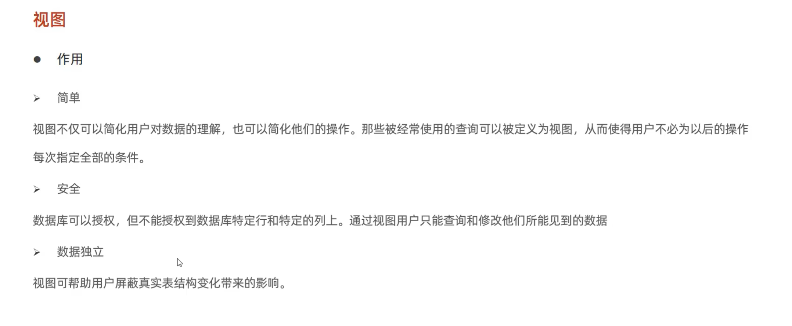

[toc]

# 这是我的MySQL笔记

## 安装各个版本的MySQL

下载

- 在linux下:[MySQL8.3](https://dev.mysql.com/get/Downloads/MySQL-8.3/mysql-8.3.0-linux-glibc2.28-x86_64.tar.xz)
- 在windows下:[MySQL8.3](https://dev.mysql.com/get/Downloads/MySQL-8.3/mysql-8.3.0-winx64.msi)

安装

- 在linux下,暂时先看[这篇文章](https://blog.csdn.net/qq_44715376/article/details/117838544)
- 在windows下:直接双击`.msi`安装包就可以了

## MySQL数据库的简单使用用和基础介绍

使用命令行窗口链接MySQL数据库
远程服务器访问

- mysql -u 用户名 -p密码 -h 主机IP -P 端口号
注意:这里的用户需要有远程连接的权限,后面会讲

> 参数解释:
1.-p后面接密码,中间没有空格
2.如果没有写-h 主机IP,则默认本机
3.如果没有写-p 端口,则默认访问3306端口
4.实际工作中,3306端口一般会修改

下面是如何使用MySQL的**示例**

```sql
create database db02;
use db02;
create table users(id int,name varchar(255),address varchar(255));
show tables;
insert into user values(1,"tom","北京")
select * from users;
```

---

数据库三层结构

1. 安装MySQL数据库就是一个在主机安装一个数据库管理系统DMBS(database manage system),这个系统可以管理多个数据库
2. 一个数据库可以创建多个表,以保存数据
3. 数据库管理系统(DBMS),数据库和表的关系如图所示

```mermaid
 graph LR
 A[客户端命令行终端-Dos或者--java中的JDBC]-->B[3306]
 B-->C[(DBMS)]
 C-->D[数据库DB01]
 D-->表1
 D-->表2
 C-->E[数据库DB02]
 E-->表3
 E-->表4
 ```

==数据中表的文件依旧是文件==

---

数据在数据库中的存储格式为:
列(column),行(row)
表的一行称为一个记录

## SQL语句分类

- DDL:数据定义语句;[create]
- DML:数据操作语句;[增删查改],[insert,update,delete等]
- DQL:数据查询语句;[select]
- [DCL](#id) :数据控制语句;[管理数据库],比如说grant,revoke等等

## 对数据库操作

- 删除数据库:

```sql
drop database 数据库名;
```

- 创建数据库

```sql
create database 数据库名;
//创建一个使用utf8指令集的数据库hsp_db02
create database hsp_db02 character set utf8;
//创建一个使用utf8字符集的并且带有校对规则(区分不区分大小写)的hsp_db03
create database hsp_db03 character set utf8 collate  utf8_general_ci;
```

查看mysql中支持的字符集和校对规则
mysql中每个字符集都会对应多个校对规则，是一对多的关系。比如utf8对应的collation有utf8_general_ci，utf8_bin，utf8_unicode_ci等。而且每个character set会有个默认的collation与之对应，当我们在创建数据库或者创建表时如果只指定character set，不指定collation，就会使用character set默认的collation。collation的命名是以对应的character set为开头，比如collation为utf8_general_ci，我们就知道这个collation对应的字符集是utf8。

如果想要知道电脑里支持哪些字符集

```sql


```

如果想知道支持哪些字符集和校对规则

```sql
show character set;//字符集
//返回结果第三列就是默认的校对规则
show collation;//校对规则
```

查看当前数据库的字符集和校对规则

```sql
show variables  like  '%character%';
show variables  like  '%collation%';
```

查看表和列的校对规则

```sql
show table status from db_name like '%table_name%' ;//表
show full columns from table_name;//列
```

[还不清楚点这里](https://www.cnblogs.com/cy0628/p/15026818.html)

- 展示出所有数据库

```sql
show databases;
```

- 显示数据库创建语句

```sql
show create database db_name;
```

- 展示表详细信息

```sql
desc table_name;
```

数据库删除语句

```sql
drop database [if exists] db_name;//if exists意思是如果存在
```

在给字段,表或者数据库取名时,最好加上反引号,否则在某中情况下会有错误

### 备份数据库和表

1.0 备份数据库,这些需要在命令行下执行

```shell
mysqldump -u root -p123456 -d 数据库1,数据库2,数据库n > 文件名.sql
```

2.1 恢复备份的数据,在mysql中执行

```sql
source 保存路径 文件名.sql
```

2.2 第二中恢复方法,直接在MySQL可视化工具里面操作

1.1 备份数据表

```shell
mysqldump -u root -p123456 -d 数据库名 -t 表1,表2 > 文件名.sql
```

2.1恢复方法跟上面一样

这一段纸没了,所以缺少了一点

### 导入导出数据

- 导出数据

```sql
SELECT column1, column2, ...
INTO OUTFILE 'file_path'
FROM your_table
WHERE your_conditions;
```

导出时有可能会出现`[HY000][1290] The MySQL server is running with the --secure-file-priv option so it cannot execute this statement`这个问题,

其实原因很简单，因为在安装MySQL的时候限制了导入与导出的目录权限。只允许在规定的目录下才能导入。

可以通过以下命令查看secure-file-priv当前的值是什么`SHOW VARIABLES LIKE "secure_file_priv";`


这是我的效果,说明我只能导出csv文件导出到`C:\ProgramData\MySQL\MySQL Server 8.0\Uploads\`

**解决方案**

问题原因找到了，解决方案因业务需求而定。

- 方案一：

把导入文件放入`secure-file-priv`目前的`value`值对应路径即可。

- 方案二：

把`secure-file-priv`的`value`值修改为准备导入文件的放置路径。

- 方案三：修改配置

去掉导入的目录限制。可修改mysql配置文件（Windows下为my.ini, Linux下的my.cnf），在[mysqld]下面，查看是否有：`secure_file_priv =`

如上这样一行内容，如果没有，则手动添加。如果存在如下`secure_file_priv = /home`

这样一行内容，表示限制为/home文件夹。而如下行:`secure_file_priv =`

这样一行内容，表示不限制目录，等号一定要有，否则mysql无法启动。

修改完配置文件后，重启mysql生效。

这是例子

```sql
SELECT id, name, email
INTO OUTFILE '/tmp/user_data.csv' #保存文件的类型和位置
FIELDS TERMINATED BY ',' # 分隔符
LINES TERMINATED BY '\n' # 换行符
FROM users;
```

- 导入数据

```sql
mysql> LOAD DATA LOCAL INFILE 'dump.txt' INTO TABLE mytbl
```

下面是例子

```sql

mysql> LOAD DATA LOCAL INFILE 'dump.txt' INTO TABLE mytbl
  -> FIELDS TERMINATED BY ':'
  -> LINES TERMINATED BY '\r\n';
```

### DCL语句操作

- 查询数据库中有哪些用户

```sql
use mysql;
select user,host from user;
```

> 注:用户的添加修改删除等操作都是在root权限下操作的!

- 创建用户

```sql
create user 'user_name'@'host' identified by password;
```

- 删除用户
  
```sql
drop user 'user_name'@'host' ;
```

- 修改用户密码

```sql
alter user 'user_name'@'host' identified  by 'new password';
```

在命令提示符下修改

```shell

mysqladmin -u <用户名> -p<旧密码> passoword <新密码>

```

- 修改用户名

```sql
rename user 'old_user_name'@'host' to 'new_user_name'@'host';
```

权限控制
|权限类型 |权限说明|
|:-:|:-:|
|All/All Privileges|代表全局或者全数据库对象级别的所有权限|
|Alter|查询权限|
|insert|代表允许修改表结构的权限，但必须要求有create和insert权限配合,如果是rename表名，则要求有alter和drop原表， create和insert新表的权限|
|Alter routine |代表允许修改或者删除存储过程、函数的权限|
|Create |代表允许创建新的数据库和表的权限|
|Create routine|代表允许创建存储过程、函数的权限|
|Create tablespace |代表允许创建、修改、删除表空间和日志组的权限|
|Create temporary tables|代表允许创建临时表的权限|
|Create user|代表允许创建、修改、删除、重命名user的权限|
|Create view|代表允许创建视图的权限|
|Delete|允许执行delete操作|
|Drop |代表允许删除数据库、表、视图的权限，包括truncate table命令|
|Event|代表允许查询，创建，修改，删除MySQL事件|
|Execute|代表允许执行存储过程和函数的权限|
|File|代表允许在MySQL可以访问的目录进行读写磁盘文件操作，可使用的命令包括load data infile,select … into outfile,load file()函数|
|Grant option|代表是否允许此用户授权或者收回给其他用户你给予的权限,重新付给管理员的时候需要加上这个权限|
|Index|代表是否允许创建和删除索引|
|Insert|代表是否允许在表里插入数据，同时在执行analyze table,optimize table,repair table语句的时候也需要insert权限|
|Lock tables| 代表允许对拥有select权限的表进行锁定，以防止其他链接对此表的读或写Process 代表允许查看MySQL中的进程信息，比如执行show processlist, mysqladmin processlist, show engine等命令|
|Reference| 是在5.7.6版本之后引入，代表是否允许创建外键|
|Reload|代表允许执行flush命令，指明重新加载权限表到系统内存中，refresh命令代表关闭和重新开启日志文件并刷新所有的表|
|lication client|代表允许执行show master status,show slave status,show binary logs命令|
|Replication slave|代表允许slave主机通过此用户连接master以便建立主从复制关系|
|Select |允许执行select操作|
|Show databases|代表允许执行show databases命令查看所有的数据库名|
|Show view|代表允许执行show create view命令查看视图创建的语句|
|Shutdown|代表允许关闭数据库实例，执行语句包括mysqladmin shutdown|
|Super|代表允许执行一系列数据库管理命令，包括kill强制关闭某个连接命令， change master to创建复制关系命令，以及create/alter/drop server等命令|
|Trigger| 代表允许创建，删除，执行，显示触发器的权限|
|Update|允许执行update操作|
|Usage|是创建一个用户之后的默认权限，其本身代表连接登录权限。使用create user语句创建的用户，默认就拥有这个usage权限，但是除了能登录之外|

- 展示用户所拥有的权限

```sql
show grants for 'user_name'@'localhost';
```

- 给用户授予权限

```sql
grant 权限[,权限2] on 数据库名.表名 to 'user_name'@'host';
flush privileges;//刷新一下权限,否则不会生效
```

- 给用户撤销权限

```sql
revoke 权限1[,权限2] on 数据库名.表名 from 'user_name'@'host';
flush privileges;//刷新一下权限,否则不会生效
```

在授权时,可以用通配符`*`代替数据库名和表名.表示所有数据库和表
例如:

```sql
grant all on *.* to 'hxl'@'localhost';//表示给root用户提供所有数据库和所有表的所有权限
```

### 函数

- 字符串函数

|函数名|功能|
|:-:|:-:|
|concat(s1,s2,s3)|将s1,s2,s3拼接成一个字符串|
|lower(str)|将str变成全小写|
|upper(str)|讲str变成全大写|
|lpad(str,n,pad)|左填充,用字符串pad对str左填充,达到n个字符长度|
|rpad(str,n,pad)|右填充,用字符串pad对str右填充,达到n个字符长度|
|trim(str)|去掉头尾的空格|
|substring(str,start,len)|返回从str字符start位置起,len个长度的字符串|

- 数值函数

|函数名|功能|
|:-:|:-:|
|ceil(x)|向下取整|
|floor(x)|向下取整|
|mod(x,y)|返回x/y的模|
|rand()|返回0-1的随机数|
|round(x,y)|求参数x的四舍五入值,保留y位小数|

- 日期函数

|函数名|功能|
|:-:|:-:|
|curdate()|返回当前日期|
|curtime()|返回当前时间|
|now()|当前日期和时间|
|year(date)|返回指定date年份|
|month(date)|获取指定的date月份|
|day(date)|获取当前日期|
|data_add(date,interval expr,type)||
|datadiff(date1,data2)|返回d1到d2的天数|

- 流程控制函数

|函数名|功能|
|:-:|:-:|
|if(expr1,expr2,expr3)|如果expr1为true返回expr2,如果expr1为false,则执行expr2|
|ifnull(expr1,expr2)|如果expr1是true,返回expr1,如果不是则返回expr2|
|case when [val1] then [res1] when [val2] then [res2] else [default] end|如果val1为true,则返回res1,如果val2为true,则返回res2,如果都不是则返回else里面的|
|case expr when [val1] then [res1] when [val2] then [res2] else [default] end|如果expr=val1,返回res1,如果expr=val2,返回res2,如果都不是返回default|

### 约束

概念:约束是作用于表中字段的规则,用于限制存储在表中的数据
目的:保证数据库中数据正确,有效保证完整型
|约束|描述|关键字|
|:-:|:-:|:-:|
|非空约束|限制该字段数据不为null|not null|
|唯一约束|保证该字段所有数据唯一|unique|
|主键约束|主键是一行数据的唯一标识|primary key|
|默认约束|保证数据时若未指定值,则采取默认值|default 默认值|
|检查约束|保证字段满足某一个条件|check|
|外键约束|用于两张表建立连接,保证数据一直完整|foreign key|

演示:

- 外键约束

> 具有外键的表是子表
> 外键关联的表是父表

下面是代码演示:

两种方式添加外键:

- 方式1:`[constraint <外键名>] foreign key 字段名 [，字段名2，…] references <主表名> 主键列1 [，主键列2，…]`

> 这是在创建表时添加外键

- 方式2:`alter table <数据表名> add constraint <外键名> foreign key(<列名>) references <主表名> (<列名>)    ;`

> 这是创建好表以后,添加外键

中间到时候填上去,现在是新的

### 视图-介绍及基本语法

视图(View)是一种虚拟的表。视图中的数据并不在数据库中实际存在，行和列数据来自定义视图的查询中使用的表，并且是在使用视图时动态生成的。

具体介绍:
视图是一个虚拟表，其内容由查询定义。同真实的表一样，视图包含一系列带有名称的列和行数据。但是，数据库中只存放了视图的定义，而并没有存放视图中的数据，这些数据存放在原来的表中。使用视图查询数据时，数据库系统会从原来的表中取出对应的数据。因此，视图中的数据是依赖于原来的表中的数据的。一旦表中的数据发生改变，显示在视图中的数据也会发生改变。同样对视图的更新，会影响到原来表的数据。

创建视图语法

```sql
create [or replace] view 视图名称[(列名列表)] as select语句 [with[ cascaded | local] check option]
```

查看创建视图语句

```sql
show create view 视图名称;
```

查看视图数据

```sql
select * from 视图名称;
```

修改视图
方式一

```sql
create [or replace] view 视图名称[(列名列表)] as select语句 [with[ cascaded | local] check option]
```

方式二

```sql
alter view 视图名称[(列名列表)] as select语句 [with[ cascaded | local] check option]
```

删除视图

```sql
drop view [if exists] 视图名称[,视图名称]
```

### 视图-检查选项(cascaded)

```sql
主要关注``包裹住的
create [or replace] view 视图名称[(列名列表)] as select语句 `[with[ cascaded | local] check option]`
with cascaded check option 会向下兼容
```

总而言之，当视图使用WITH CASCADED CHECK OPTION时，mysql会循环检查视图的规则以及底层视图的规则
可以利用视图创建视图

```sql
create or replace view user_v2 as select id,name from user_v1 where id <=20;
```

### 视图-检查选项(local)

找到当前视图依赖的视图,如果有检查选项则会执行,否则不会检查

这次会插入成功。这是因为v2视图没有任何规则。 v2视图取决于v1视图。 但是，v1视图没有指定检查选项，因此mysql跳过检查v1视图中的规则。我们要注意，在使用WITH CASCADED CHECK OPTION创建的v2视图中，此语句失败。

### 视图-更新



