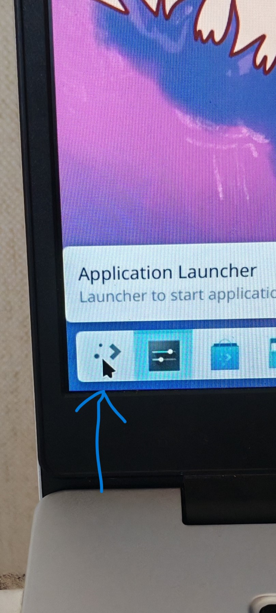
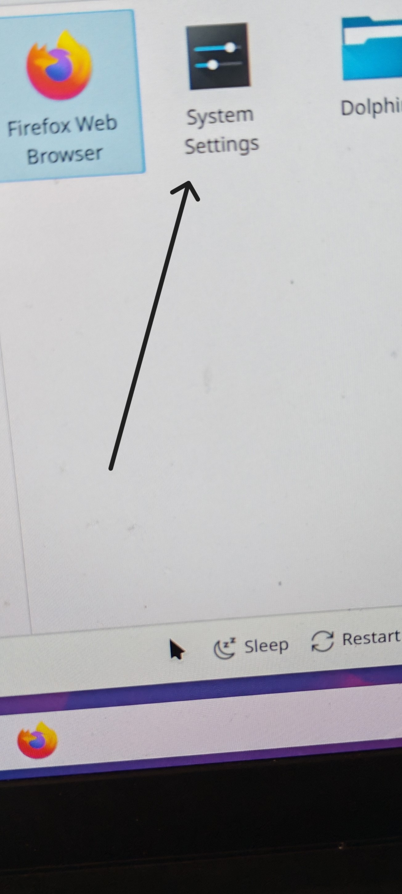
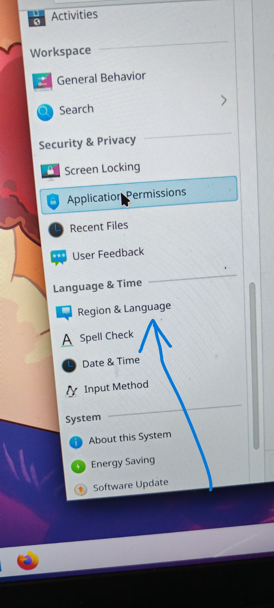
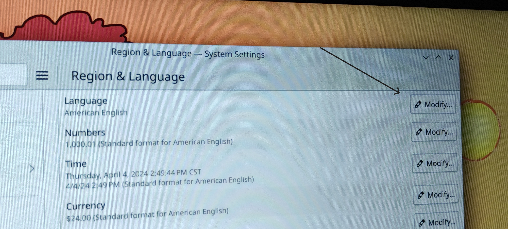
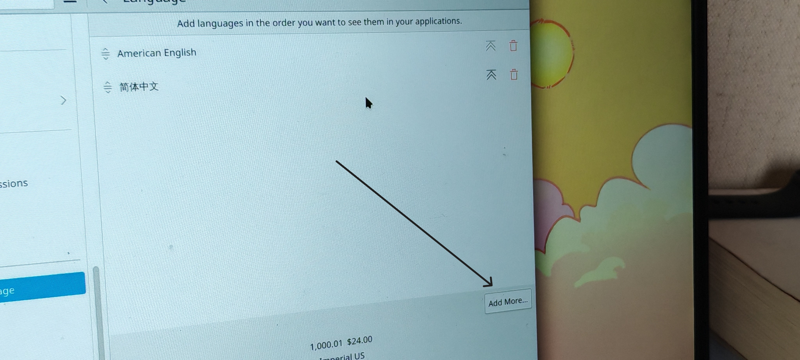
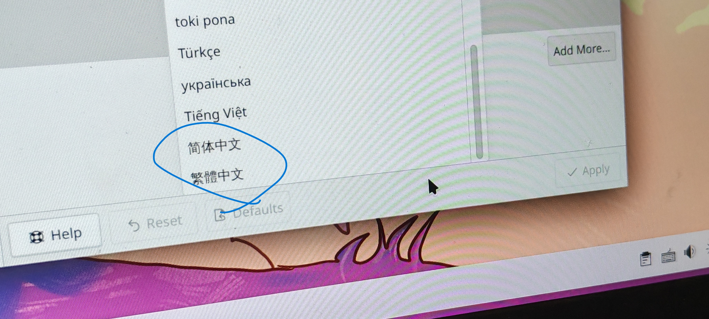
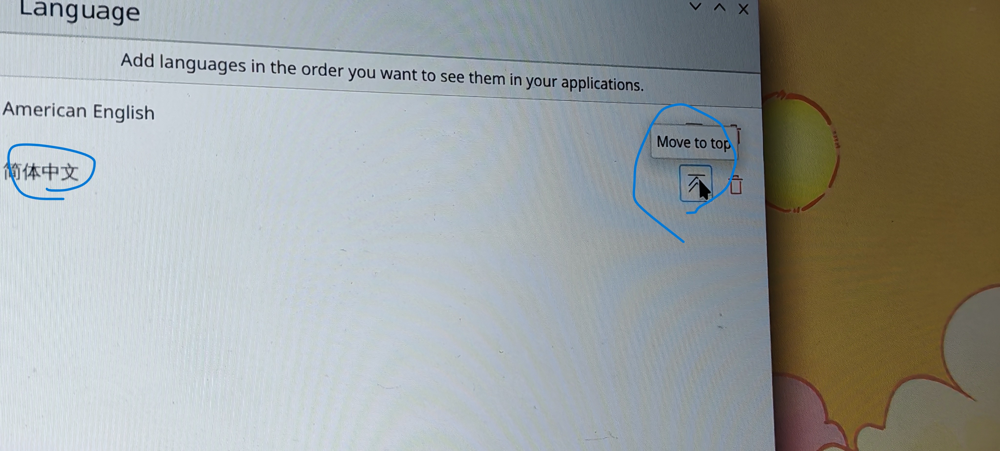

# 这篇文章旨在教大家如何配置arch中文和中文输入法和对时间的调整

主要解决三点问题
1.显示中文
2.使用中文输入法
3.显示正确的时间
[toc]

> 我arch版本是[**archlinux2024.3.29 X86-64**](https://mirrors.aliyun.com/archlinux/iso/2024.03.29/archlinux-2024.03.29-x86_64.iso?spm=a2c6h.25603864.0.0.19cb51c4H2mObT)
> 桌面环境是**KDE 6.0.3**

## 第一步,就是把arch切换成中文

==!注意==:下面的编辑文件用的都是vim,可以使用`sudo pacman -S vim`来下载,不下载的话使用`vi`也是可以的

1.首先`vim /eyc/locale.gen`打开这个文件
    - 找到zh_CN UTF-8 UTF-8,去掉前面的`#`号,
    - 然后执行`sudo locale-gen`这个命令

> 这几条命令的作用是让`arch`支持中文

2.然后下载字体文件,只要选择一个就可以了,格式`sudo pacman -S 字体名`.推荐`noto-fonts-cjk`,博主用的是这个

```txt
adobe-source-han-sans-cn-fonts
adobe-source-han-serif-cn-fonts
noto-fonts-cjk
wqy-microhei
wqy-microhei-lite
wqy-bitmapfont
wqy-zenhei
ttf-arphic-ukai
ttf-arphic-uming
```

3.然后重启`sudo reboot now`

4.下面需要配图食用,有箭头指引















然后重启,点击`restart now`

## 第二步,就是如何使用中文输入法

- 需要安装以下的软件

```shell
sudo pacman -S fcitx5-im
sudo pacman -S fcitx5-chinese-addons  fcitx5-rime
```

> fcitx5-chinese-addons 包含了大量中文输入方式：拼音、双拼、五笔拼音、自然码、仓颉、冰蟾全息、二笔等
fcitx5-rime 对经典的 Rime IME 输入法的包装，内置了繁体中文和简体中文的支持。

- 然后在环境变量配置文件`sudo vim /etc/environment`中添加如下内容

```shell
GTK_IM_MODULE=fcitx
QT_IM_MODULE=fcitx
XMODIFIERS=@im=fcitx
INPUT_METHOD=fcitx
SDL_IM_MODULE=fcitx
GLFW_IM_MODULE=ibus
```

- 都设置好了以后`sudo reboot now`,重启,右击右下角类似于键盘的东西,点击配置

- 在右下角找到添加输入法,找到拼音,添加就可以了,按`ctrl+空格`开关输入法,`shift`切换

## 时间问题解决

你一开始有可能会发现时间怎么不对,所以需要设置时区和打开时间同步服务,命令如下

```shell
timedatectl set-timezone Asia/Shanghai
timedatectl set-ntp true
```

然后你就会发现时间变正常了

**谢谢观看,不知道这篇文章有没有对大家有所帮助,写的有不太好的地方(内容和格式),请大家多多评论,这对我的进步很重要.**
