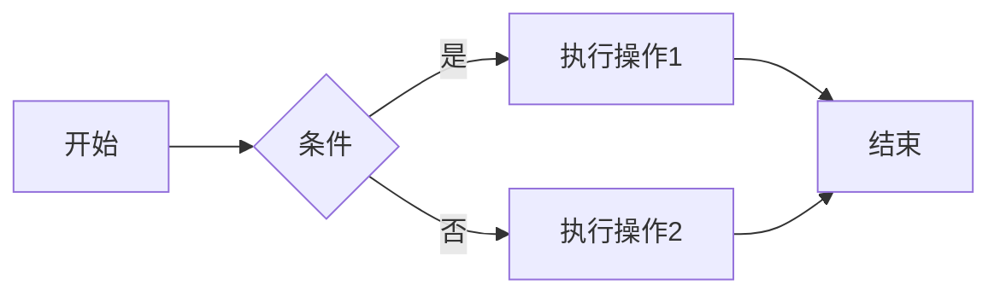

[toc]

# 一级标题

## 二级标题

### 三级标题

```mermaid
graph LR
    A[开始] --> B{条件}
    B -- 是 --> C[执行操作1]
    B -- 否 --> D[执行操作2]
    C --> E[结束]
    D --> E
```

- [x] 完成状态

六的二次方表示方法:6^2^

水分子表示方式:H~2~O

>你好
>>我真的
>>>哭死