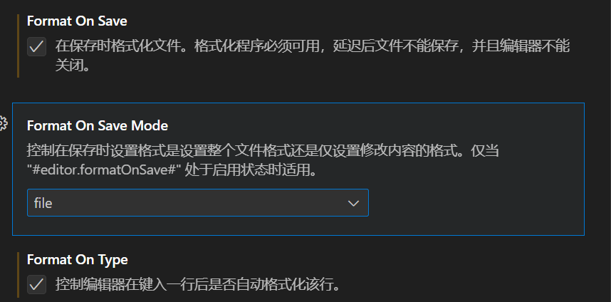

# 以下是教大家如何使用并配置vscode

1. 下载vscode[官网](https://code.visualstudio.com/)
2. 选择下载版本,根据自己的需求选择

## 安装完成以后第一步当然是让我们的vscode变成中文

[**需要安装以下插件**]

> 插件名称:Chinese (Simplified) (简体中文) Language Pack for Visual Studio Code

## 以下可以选择编程语言的插件

- 如果你想使用vscode编辑==markdown==文件变的更加舒服,需要安装以下插件
  - Markdown All in One
  - mardownlint
  - Markdown Kroki
  - Markdown Preview Enhanced

> Markdown Preview Enhanced这个插件可以让vscode编写markdown时支持高亮,安装好以后,只需要按ctrl+k+v就可以展示预览

- 如果你想使用vscode编辑==Java==文件,需要安装以下插件
  - Extension Pack for Java
    > 不用担心一个够不够,因为它里面已经包括了6个你编辑==Java==需要的基本插件

## 以下是如关于如何优化编程体验的操作

01. 让光标变得更加顺滑

> 具体操作:点击右下角设置图标,再点击设置,点开文本编辑复选框,再点击光标,修改为以下样式即可

2. 让你的代码写完以后以后变的格式更加美丽,不用再手动修改代码之间的分隔

> 具体操作:点击右下角设置图标,再点击设置,点开文本编辑复选框,再点击格式化,修改为以下样式即可

## 作者的工具分享

==$kimichat$==,这是一个AI工具,不用魔法,只需要注册一个账号就可以了,会自己去网上搜索资料,你也可以把文件和网页发送给他,它会自动分析

## 以下是我的vscode快捷键分享

- 按 Press功能 Function

>Ctrl + Shift + P，F1显示命令面板 Show Command Palette
>Ctrl + P 快速打开 Quick Open
>Ctrl + Shift + N 新窗口/实例 New window/instance
>Ctrl + Shift + W 关闭窗口/实例 Close window/instance

- 基础编辑 Basic editing

>按 Press 功能 Function
Ctrl+X 剪切行（空选定） Cut line (empty selection)
Ctrl+C 复制行（空选定）Copy line (empty selection)
Alt+ ↑ / ↓ 向上/向下移动行 Move line up/down
Shift+Alt + ↓ / ↑  向上/向下复制行 Copy line up/down
Ctrl+Shift+K 删除行 Delete line
Ctrl+Enter 在下面插入行 Insert line below
Ctrl+Shift+Enter 在上面插入行 Insert line above
Ctrl+Shift+\ 跳到匹配的括号 Jump to matching bracket
Ctrl+] / [ 缩进/缩进行 Indent/outdent line
Home 转到行首 Go to beginning of line
End  转到行尾 Go to end of line
Ctrl+Home  转到文件开头 Go to beginning of file
Ctrl+End 转到文件末尾 Go to end of file
Ctrl+↑ / ↓ 向上/向下滚动行 Scroll line up/down
Alt+PgUp / PgDown 向上/向下滚动页面 Scroll page up/down
Ctrl+Shift+[ 折叠（折叠）区域 Fold (collapse) region
Ctrl+Shift+] 展开（未折叠）区域 Unfold (uncollapse) region
Ctrl+K Ctrl+[ 折叠（未折叠）所有子区域 Fold (collapse) all subregions
Ctrl+K Ctrl+] 展开（未折叠）所有子区域 Unfold (uncollapse) all subregions
Ctrl+K Ctrl+0 折叠（折叠）所有区域 Fold (collapse) all regions
Ctrl+K Ctrl+J 展开（未折叠）所有区域 Unfold (uncollapse) all regions
Ctrl+K Ctrl+C 添加行注释 Add line comment
Ctrl+K Ctrl+U 删除行注释 Remove line comment
Ctrl+/ 切换行注释 Toggle line comment
Shift+Alt+A 切换块注释 Toggle block comment
Alt+Z 切换换行 Toggle word wrap

- 导航 Navigation

>按 Press 功能 Function
Ctrl + T 显示所有符号 Show all Symbols
Ctrl + G 转到行... Go to Line...
Ctrl + P 转到文件... Go to File...
Ctrl + Shift + O 转到符号... Go to Symbol...
Ctrl + Shift + M 显示问题面板 Show Problems panel
F8 转到下一个错误或警告 Go to next error or warning
Shift + F8 转到上一个错误或警告 Go to previous error or warning
Ctrl + Shift + Tab 导航编辑器组历史记录 Navigate editor group history
Alt + ←/→ 返回/前进 Go back / forward
Ctrl + M 切换选项卡移动焦点 Toggle Tab moves focus

- 搜索和替换 Search and ==replace==

> 按 Press 功能 Function
Ctrl + F 查找 Find
Ctrl + H 替换 Replace
F3 / Shift + F3 查找下一个/上一个 Find next/previous
Alt + Enter 选择查找匹配的所有出现 Select all occurences of Find match
Ctrl + D 将选择添加到下一个查找匹配 Add selection to next Find match
Ctrl + K Ctrl + D 将最后一个选择移至下一个查找匹配项 Move last selection to next Find match
Alt + C / R / W 切换区分大小写/正则表达式/整个词 Toggle case-sensitive / regex / whole word

- 多光标和选择 Multi-cursor and selection

>Alt +单击 插入光标 Insert cursor
Ctrl + Alt +↑/↓ 在上/下插入光标 Insert cursor above / below
Ctrl + U 撤消上一个光标操作 Undo last cursor operation
Shift + Alt + I 在选定的每一行的末尾插入光标 Insert cursor at end of each line selected
Ctrl + I 选择当前行 Select current line
Ctrl + Shift + L 选择当前选择的所有出现 Select all occurrences of current selection
Ctrl + F2 选择当前字的所有出现 Select all occurrences of current word
Shift + Alt + → 展开选择 Expand selection
Shift + Alt + ← 缩小选择 Shrink selection
Shift + Alt + （拖动鼠标） 列（框）选择 Column (box) selection
Ctrl + Shift + Alt +（箭头键） 列（框）选择 Column (box) selection
Ctrl + Shift + Alt + PgUp / PgDown 列（框）选择页上/下 Column (box) selection page up/down

- 丰富的语言编辑 Rich languages editing

> 按 Press 功能 Function
Ctrl + 空格 触发建议 Trigger suggestion
Ctrl + Shift + Space 触发器参数提示 Trigger parameter hints
Tab Emmet 展开缩写 Emmet expand abbreviation
Shift + Alt + F 格式化文档 Format document
Ctrl + K Ctrl + F 格式选定区域 Format selection
F12 转到定义 Go to Definition
Alt + F12 Peek定义 Peek Definition
Ctrl + K F12 打开定义到边 Open Definition to the side
Ctrl + . 快速解决 Quick Fix
Shift + F12 显示引用 Show References
F2 重命名符号 Rename Symbol
Ctrl + Shift + . /， 替换为下一个/上一个值 Replace with next/previous value
Ctrl + K Ctrl + X 修剪尾随空格 Trim trailing whitespace
Ctrl + K M 更改文件语言 Change file language

- 编辑器管理 Editor management

> Ctrl+F4, Ctrl+W 关闭编辑器 Close editor
> Ctrl+K F 关闭文件夹 Close folder
> Ctrl+\ 拆分编辑器 Split editor
> Ctrl+ 1 / 2 / 3 聚焦到第1，第2或第3编辑器组 Focus into 1st, 2nd or 3rd editor group
> Ctrl+K Ctrl+ ←/→ 聚焦到上一个/下一个编辑器组 Focus into previous/next editor group
> Ctrl+Shift+PgUp / PgDown 向左/向右移动编辑器 Move editor left/right
> Ctrl+K ← / → 移动活动编辑器组 Move active editor group

- 文件管理 File management

> 按 Press 功能 Function
> Ctrl+N 新文件 New File
> Ctrl+O 打开文件... Open File...
> Ctrl+S 保存 Save
> Ctrl+Shift+S 另存为... Save As...
> Ctrl+K S 全部保存 Save All
> Ctrl+F4 关闭 Close
> Ctrl+K Ctrl+W 关闭所有 Close All
> Ctrl+Shift+T 重新打开关闭的编辑器 Reopen closed editor
> Ctrl+K 输入保持打开 Enter Keep Open
> Ctrl+Tab 打开下一个 Open next
> Ctrl+Shift+Tab 打开上一个 Open previous
> Ctrl+K P 复制活动文件的路径 Copy path of active file
> Ctrl+K R 显示资源管理器中的活动文件 Reveal active file in Explorer
> Ctrl+K O 显示新窗口/实例中的活动文件 Show active file in new window/instance

- 显示 Display

> F11 切换全屏 Toggle full screen
Shift+Alt+1 切换编辑器布局 Toggle editor layout
Ctrl+ = / - 放大/缩小 Zoom in/out
Ctrl+B 切换侧栏可见性 Toggle Sidebar visibility
Ctrl+Shift+E 显示浏览器/切换焦点 Show Explorer / Toggle focus
Ctrl+Shift+F 显示搜索 Show Search
Ctrl+Shift+G 显示Git Show Git
Ctrl+Shift+D 显示调试 Show Debug
Ctrl+Shift+X 显示扩展 Show Extensions
Ctrl+Shift+H 替换文件 Replace in files
Ctrl+Shift+J 切换搜索详细信息 Toggle Search details
Ctrl+Shift+C 打开新命令提示符/终端 Open new command prompt/terminal
Ctrl+Shift+U 显示输出面板 Show Output panel
Ctrl+Shift+V 切换Markdown预览 Toggle Markdown preview
Ctrl+K V  从旁边打开Markdown预览 Open Markdown preview to the side

- 调试 Debug

> F9  切换断点 Toggle breakpoint
F5  开始/继续 Start/Continue
Shift+F5  停止 Stop
F11 / Shift+F11 下一步/上一步 Step into/out
F10 跳过 Step over
Ctrl+K Ctrl+I 显示悬停 Show hover
集成终端 Integrated terminal
按 Press  功能 Function
Ctrl+`显示集成终端 Show integrated terminal
Ctrl+Shift+`  创建新终端 Create new terminal
Ctrl+Shift+C  复制选定 Copy selection
Ctrl+Shift+V  粘贴到活动端子 Paste into active terminal
Ctrl+↑ / ↓  向上/向下滚动 Scroll up/down
Shift+PgUp / PgDown 向上/向下滚动页面 Scroll page up/down
Ctrl+Home / End 滚动到顶部/底部 Scroll to top/bottom
